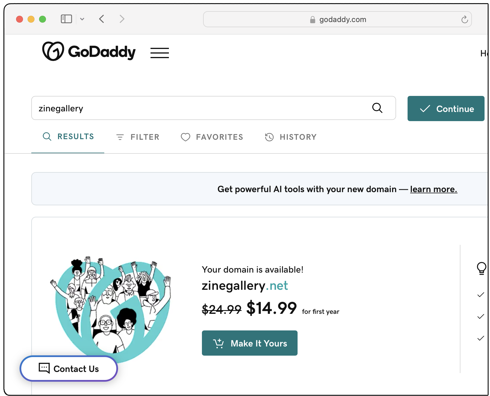
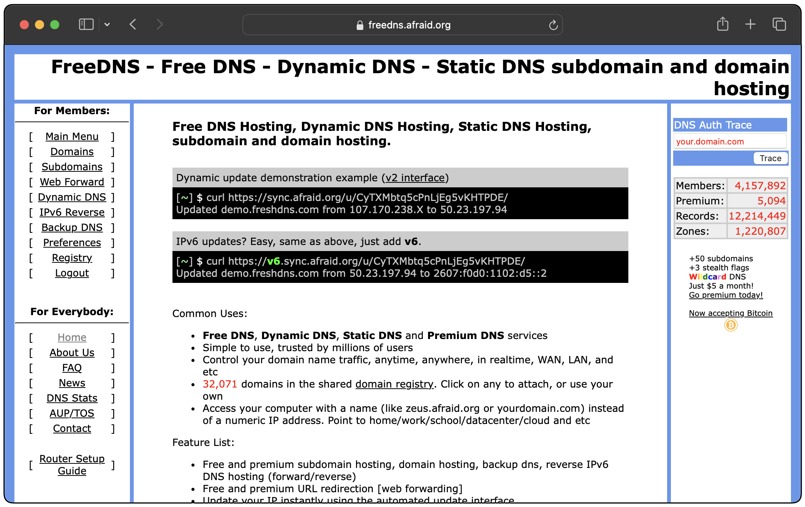
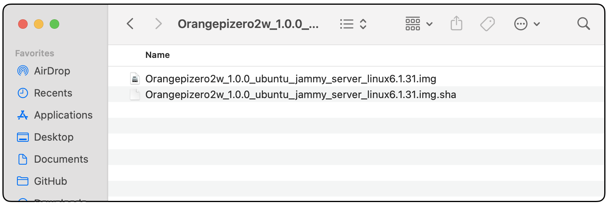
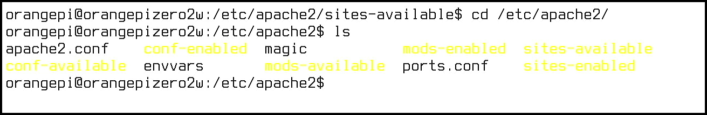
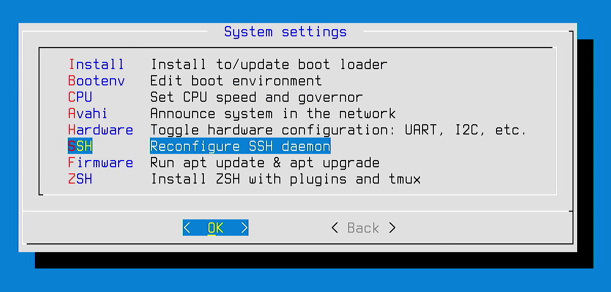
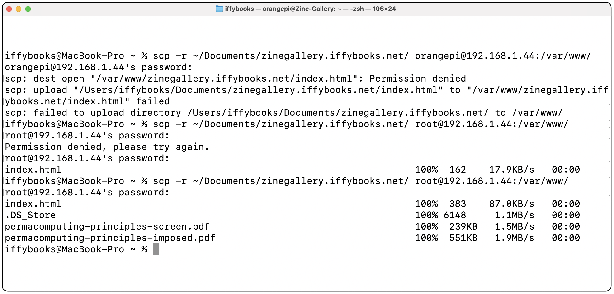
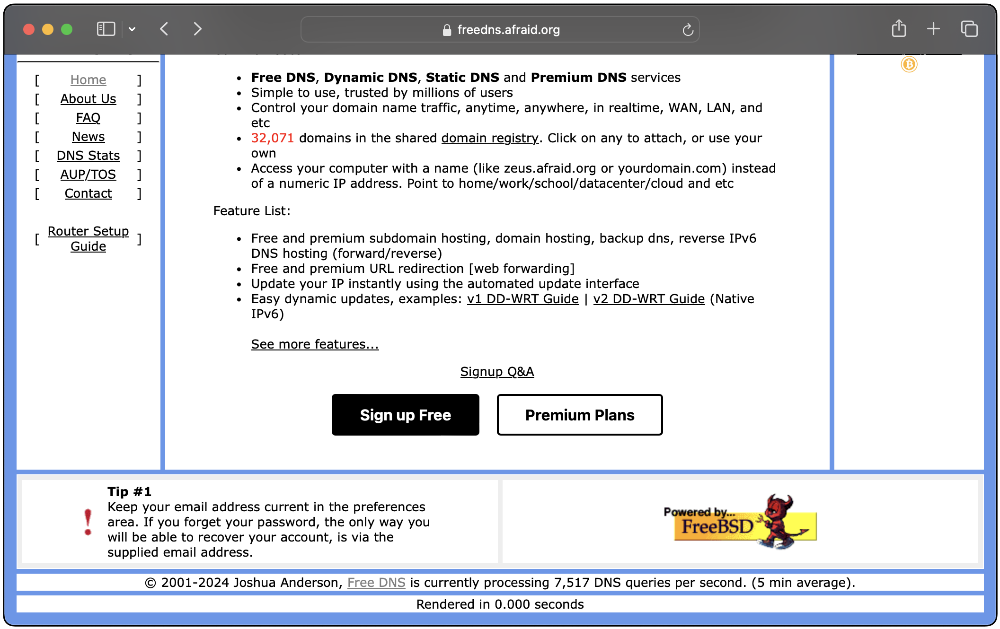
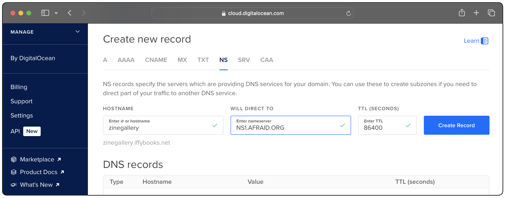
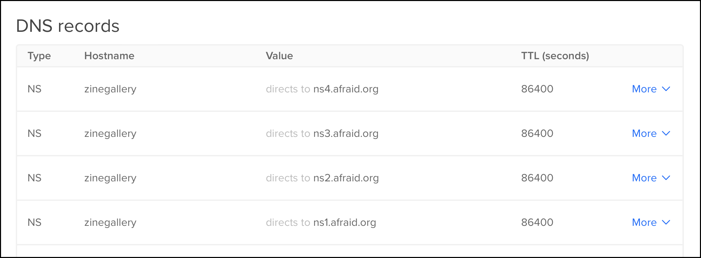

## 


## 

## Why  host a website at home?

- You control what you post.

- You can definitively take down your website by unplugging it. 

- Commercial hosting starts around $5 per month, so hosting at home may be cheaper in the long run.

- Learning about networking is fun and useful.

In this project you'll learn to set up an Ubuntu-based web server on a single-board computer, using Apache HTTP Server to serve your website. You'll configure Apache the proper way, letting you host multiple websites on the same machine if you wish. Then you'll set up port forwarding on your router to expose your site to the open web. Finally, you'll configure Dynamic DNS (DDNS) with a domain or subdomain, so your website will be accessible even when your ISP changes your home IP address.

The examples in this zine use the Orange Pi Zero 2W, an inexpensive single-board computer that uses very little power. You can buy an OPZ2W with 1 GB of RAM for around $20, but you'll need some additional hardware to get up and running.

We sell complete home web server kits at Iffy Books. The kit costs $49 as of May 2024, and includes the following:

• Orange Pi Zero 2W single-board computer w/1 GB of RAM
• 32 GB microSD card
• microSD card reader
• 2 A USB power supply
• USB-C power cable
• Mini HDMI to HDMI adapter
• USB-C to 2x USB-A adapter
• USB-A to Ethernet adapter
• Ethernet cable

## Choose a domain

### Option 1: Choose a subdomain for a domain you already own.

❏ If you've already registered a domain and you'd like to create a subdomain for this project, the only thing you need to do at this point is decide what subdomain to use. For the examples below we'll use **zinegallery.iffybooks.net**. 

Your subdomain can be up to 63 characters long (case insensitive).We'll update your  domain records later.

### Option 2: Buy a domain

❏ Go to a domain registry of your choice and pay to register a domain name. You'll need to create an account and enter your credit card info.



### Option 3: Sign up for a free subdomain from a DDNS provider

❏ Go to **freedns.afraid.org** and set up a free subdomain.



## Flash Ubuntu to your SD card

❏ Next you'll download the Ubuntu OS image for your device. If you're using an Orange Pi Zero 2W, go to the following URL:

http://www.orangepi.org/html/hardWare/computerAndMicrocontrollers/service-and-support/Orange-Pi-Zero-2W.html

❏ Under **Ubuntu Image**, click **Downloads**.


❏ That link will direct you to Google Drive. Double click **Linux6.1 kernel version image** to open the directory.


❏ Double click on the directory **For development boards with 1GB_2GB memory...** to open it.


❏ Right click the file with **server** in the filename and select **Download** to download the disk image file.


❏ Find the file you just downloaded, `Orangepizero2w_1.0.0_ubuntu_jammy_server_linux6.1.31.7z`, in your File Explorer/Finder. Double click the file to extract its contents.

❏ You'll end up with a directory containing a disk image file ending with `.img`, along with a `.sha` checksum file.



❏ Now go to the following URL and download the program balenaEthcher:

[https://etcher.balena.io](https://etcher.balena.io)

❏ Insert your micro SD card into a USB card reader and plug it into your computer.

❏ Open balenaEtcher, click **Flash from file**, and select the `.img` disk image file you just extracted.


❏ In balenaEtcher, click **Select target** and select your SD card.

❏ Click **Flash!** to write the Ubuntu disk image to your SD card, which will take 5 minutes or so.

## Set up your computer

❏ Insert your newly flashed micro SD card into the card slot on your single-board computer.


## Turn on your computer

❏ Plug a USB-C cable into your computer and connect it to a USB power supply (2 amps or more).

❏ After a brief startup sequence, your screen should look like this:


*(Note: From this point forward we'll invert the colors in screen captures in order to use less printer toner.)*

❏ First you'll set a password. Type `passwd` at the command prompt, then press enter.


 

❏ For the current pasword, type `orangepi` and press enter, or `raspberrypi` if you're using a Raspberry Pi. You won't see any characters appear onscreen as you type. Then choose a new password and enter it. Write down your new password and/or store it in a password manager app.


❏ You're currently logged in as a user called `orangepi`. Next you'll switch to the `root` user and change its password.

❏ Type `su root` and press enter. At the prompt, enter the default password `orangepi`.


❏ Now type `passwd` and press enter to set a new password for your `root` account.


❏ When you're done, run the command `su orangepi` to switch back to the user `orangepi`.


 

### Increase the onscreen text size (optional)

If the onscreen text looks too small to read comfortably, follow the steps below to increase the size. Otherwise you can skip to the next step.

❏ Run the following command to open the `console-setup` preferences file using the text editor `nano`:

```
sudo nano /etc/default/console-setup
```


 

❏ Use the arrow keys on your keyboard to move the cursor to the line beginning with `FONTSIZE=`. Delete the value `8x16` and replace it with `16x32`.


 

❏ When you're finished, press `ctrl + X` on your keyboard to close the file. At the bottom left of your screen you'll see the prompt **"Save modified buffer?"** Type `y` for "yes," then press **enter**.


 

❏ Press enter again to confirm the filename.


 

❏ *Tip: You can use the command `clear` at any time to clear the whole screen.*


 

❏ Now run the command `sudo update-initramfs -u` to confirm the new font size.


 

❏ Reboot your computer with `sudo reboot`.


 

When your computer finishes rebooting, the font will be bigger.

## Connect to the internet via Ethernet

*If you want to use wi-fi temporarily, you can skip to the next section.*

❏ Connect an Ethernet cable to your home router.

❏ Connect the other end of the Ethernet cable to your Ethernet-to-USB adapter.

❏ Plug USB end of the Ethernet-to-USB adapter into the open USB port on your single-board computer.

## Connect to the internet via wi-fi (discouraged 😊)

*If your computer is connected to your router via Ethernet, you can skip this section.*

Run the command `sudo orangepi-config` to launch the Orange Pi configuration utility. (On a Raspberry Pi, use `sudo raspi-config` instead.)


 

❏ You'll see a prompt that reads **"Configuration cannot work properly without a working internet connection."** Press any key to continue.


 

❏ Use the down arrow key to select the `Network` menu, then press enter.


 

❏ Use the down arrow key to select the `WiFi` menu, then press enter.


 

❏ You'll see a list of available wi-fi networks. Select your home network, then press enter. *(Note: Some routers let you create a secondary wi-fi network, intended to keep IoT (Internet of Things) devices like security cameras separate from your primary network. If you're planning to leave your server connected to wi-fi, you may want to use your router's IoT network as a security precaution.)*


 

❏ Enter your password at the prompt.


 

❏ Use the arrow keys to select `Quit`, then press enter.


 

❏ Use the arrow keys to select `Back` , then press enter.


 

❏ Now select `Exit`. Then press **enter** to close the configuration menu.


 

## Update your system software

❏ Now that you're connected to the internet, you'll want to update your software packages. This step is important because some packages may need updates for security reasons.

❏ Type the command below (actually two commands separated by `&&`, then press enter. 

```
sudo apt update && sudo apt-y upgrade
```


 

❏ Enter your password at the prompt and press enter. It may take 10+ minutes for your packages to download and update.

 

## Update your hostname

Your **hostname** is a short alphanumeric name for each device on a network, sort of like a nickname. Setting a descriptive hostname will make it easier to tell which device is which (for example, when using your router admin panel). 

❏ To see your curent hostname, enter the command `hostname` and press enter. The default hostname is `orangepizero2w`.


 

❏ Now run the command below, replacing **Zine-Gallery** with a descriptive name for your server (no spaces allowed, but hyphens are OK). You'll be prompted to enter your password.

```
hostnamectl set-hostname Zine-Gallery
```


 

## Set up a firewall

A firewall is a piece of software that restricts access to your device over the network. In this section you'll install and configure the firewall `ufw`, which will permit or deny each network request (inbound and outbound).

❏ You'll start by installing `ufw` (short for "Uncomplicated Firewall"). Run the command `sudo apt install ufw`, then follow the prompts.


 

❏ Run the command below to deny incoming network connections by default.

```
sudo ufw default deny incoming
```


 

❏ Run the command below to allow outgoing network connections by default.

```
sudo ufw default allow outgoing
```


 

❏ Run the command below to allow incoming TCP connections on port 80:

```
sudo ufw allow 80/tcp
```


 

❏ Now run the command below to allow incoming TCP connections on port 22. This will make it possible to connect to your server via SSH, which we'll set up in a later section.

```
sudo ufw allow 22/tcp
```


❏ Now run the command `sudo ufw enable` to turn on your firewall.


## Install Apache

Next you'll install Apache HTTP Server, one of the most widely used web server programs. *(Note: The term "web server" can refer to a piece of software that serves websites, like Apache. "Web server" can also refer to the computer the software is running on.)*

❏ Run the command below to install Apache. You'll be prompted to enter your password.

```
sudo apt install apache2
```


 

Now you'll make a directory to store your website files in. The `mkdir` command makes a directory, and the `-p` option creates any parent directories in the path if they don't already exist.

❏ Type the command below to create the directory you'll use for your website files, replacing `zinegallery.iffybooks.net` with the domain you chose earlier.

```
sudo mkdir -p /var/www/zinegallery.iffybooks.net
```


 

❏ Use `chown` to set the current user (`orangepi`) as the owner of the directory you just created. (Replace `zinegallery.iffybooks.net` below with the name of the dictory you just created.)

```
sudo chown -R $USER:$USER /var/www/zinegallery.iffybooks.net
```


 

❏ Now use `chmod` to set read-write-execute permissions for the directory `/var/www/`. The `755` option means only the owner (`orangepi`) can write to the directory, while all users will have read and execute permissions.

```
sudo chmod -R 755 /var/www/
```


 

❏ Use `cd` to change your current working directory to the directory you just created. *(Tip: After typing `/var/www/` and the first letter or two of your directory name, press **tab** to autocomplete the rest of the pathname.)*

```
cd /var/www/zinegallery.iffybooks.net/
```


 

❏ Next you'll use the text editor `nano` to create a file called `index.html`. This will be the first page people will see when they visit your website.

```
sudo nano index.html
```


 

❏ Now you'll type out some HTML code for a basic web page, just to use as a test. You can adapt the code below, or do a web search for example web pages.

```
<!DOCTYPE html>
<html>
    <head>
        <title>Zine Gallery</title>
    </head>
    <body>
        <h1>Welcome to the Zine Gallery!</h1>
        <p>(still under construction!)</p>
    </body>
</html>
```


&nbsp;

❏ When you're ready to save your file, press **ctrl+X** to exit. Follow the prompts at the bottom of the screen to save the file.

## Create Apache configuration file

❏ Run the command below to change your current working directory to `/etc/apache2/sites-available`.

```
cd /etc/apache2/sites-available/
```


&nbsp;

❏ Type `ls` and press **enter** to see what files are in the current directory.


&nbsp;

❏ Use `cp` to make a copy of the file `000-default.conf`. In the example below, the new file will be called `zinegallery.iffybooks.net.conf`; yours should be the domain you chose earlier followed by `.conf`.

```
sudo cp 000-default.conf zinegallery.iffybooks.net.conf
```


&nbsp;

❏ Now you'll use `nano` to open the configuration file you just created.

```
sudo nano zinegallery.iffybooks.net.conf
```


&nbsp;

❏ Use your arrow keys to move the cursor to the line `DocumentRoot /var/www/html`. Delete `html` at the end and replace it with the name of the directory where your website files are located (i.e., the domain you chose). Here's an example:

```
DocumentRoot /var/www/zinegallery.iffybooks.net
```


&nbsp;

❏ Create two new lines above the one you just edited, and type out the following options. (If you decide to host more than one website on your server, you'll update these lines later.) When you're done, press **ctrl + X** and follow the prompts to save the file.

```
ServerName localhost
ServerAlias localhost
```


&nbsp;

## Enable your website

❏ Run the following command to have Apache enable your website:

```
sudo a2ensite zinegallery.iffybooks.net.conf
```


&nbsp;

❏ Next, run this command to disable the site Apache runs by default:

```
sudo a2dissite 000-default.conf
```


&nbsp;

❏ Restart Apache with the following command:

```
systemctl reload apache2
```


&nbsp;

## Set up ports.conf

❏ Run the command `cd /etc/apache2/` to change your curent working directory to `/etc/apache2/`. Then use `ls` to view the directory's contents.



&nbsp;

❏ Use the following command to open the configuration file `ports.conf` with the text editor `nano`.

```
sudo nano ports.conf
```


&nbsp;

❏ Find the line beginning with "Listen" and update it to match the line below. This change will expose your Apache website to other devices on your network.

```
Listen 0.0.0.0:80
```


&nbsp;

## Find your IP address

❏ Run the command `ip addr` to find your IP address on the local network. Look for a line beginning with `inet 192.168.`, which will be under `eth0` if you're using ethernet or `wlan0` if you're using wi-fi. In the example below, the server's local IP address is `192.168.1.44`.


## Test your site on the local network

❏ On a computer connected to the same network as your server, open a web browser, type the server's IP address in the address bar, and press enter. You should see your test website!


## Set a static IP address

❏ Ordinarily, when you connect a computer to a network it's assigned a local IP address by a DHCP server program running on the router. Every time you connect to the network your machine will be given an arbitrary address that isn't already taken, typically beginning with `192.168`.

Alternatively, you can give your computer a static IP address that never changes. In this case, a static IP address is required to set up port forwarding, which we'll cover in a future step.

Run the command `sudo orangepi-config` to launch the Orange Pi configuration utility. (On a Raspberry Pi, use `raspi-config` instead.)


&nbsp;

❏ Select the `Network` menu and press enter.


&nbsp;

❏ Select `IP` and press enter.


&nbsp;

❏ Select the `eth0` option if your computer is connected via Ethernet, or select the option beginning with `en` if you're using wi-fi. (We recommend using Ethernet if possible, but we're using wi-fi in the example below.)


&nbsp;

❏ Select the `Static` option and press enter.


&nbsp;

❏ Next to `Address`, enter the local IP address you'd like to use. It should begin with `192.168.1.` and end with a number from 2 to 255. You may want to leave this option as-is, because you know your DHCP-assigned IP address isn't being used by another device. Select `OK` and press enter to save your configuration.


&nbsp;

❏ Select `Back` and press enter.


&nbsp;

❏ Select `Exit` and press enter to close the configuration utility.


&nbsp;

## Enable local SSH access

&nbsp;

❏ Run the command `so orangepi-config` to open the Orange Pi configuration utility.


&nbsp;

❏ Select `System` and press enter.


&nbsp;

❏ Select `SSH` and press enter.



&nbsp;

❏ The first three options (`PermitRootLogin`, `Password Authentication`, and `PubkeyAuthentication`) should be selected by default. Move your cursor to `Save` and press enter to enable SSH access.


&nbsp;

❏ Select `Back` and press enter.


&nbsp;

❏ Select `Exit` and press enter to close the configuration utility.


&nbsp;

❏ Run the command `reboot` to reboot your computer.

## 

## Reboot

abcde ...

## Test your SSH connection

From a terminal window on your desktop computer, run the following command to start an **ssh** session with your server.

```
ssh orangepi@192.168.1.44
```

When you're done, you can use the command `exit` to end the ssh session.

## Update your website from another computer using scp





## Set up port forwarding on your router

❏ Open a web browser on a desktop computer and enter the IP address for your router's admin panel. There's a good chance the IP address is `192.168.1.1`. Press enter, then log in with your admin password.

If your ISP is V\*\*\*\*\*\*\*, you'll need to click **Advanced** at the top of the window to switch to the advanced admin panel.


❏ Navigate to **Security & Firewall**, then **Port Forwarding**.


❏ Under **Application**, give your server a name. The example is called `Zine Gallery Server`. For **Original Port** and **Forward to Port**, enter `80`. **Protocol** should be set to `TCP`. Under **Fwd to Addr**, type your server's static IP address. When you're done, click **Add to list** to create your port forwarding rule.


❏ To confirm port forwarding works, go to `ipchicken.com` and find your home IP address.


&nbsp;


❏ Copy and paste your home IP address into your URL bar and press enter, and you should see your website.

## Set up DDNS for your own domain or subdomain

*Note: If you created a subdomain through dynv6 at the beginning of the project, you can skip this step.*


❏



❏


❏ Go to your email and follow the confirmation link.

❏ Click **Domains** in the left column.


❏ Click Add a domain into FreeDNS    

❏

❏


❏ Next you'll update your domain settings to use the following three name servers for your domain or subdomain:

- NS1.AFRAID.ORG  
- NS2.AFRAID.ORG  
- NS3.AFRAID.ORG  
- NS4.AFRAID.ORG

If you're using a domain you just registered, you can update your domain records on the site where you registered it.

If you're using a subdomain with a domain you're already using, you can update your domain records through your VPS provider or hosting service. On DigitalOcean, for example, you can find domain settings under **Manage > Networking > Domains**.

Create a new **NS** (name server) record for the domain or subdomain you're using, and enter `ns1.afraid.org` as the same server. Click **Create Record**.



❏ Repeat the previous step for the nameservers `ns3.afraid.org`, `ns3.afraid.org` and `ns4.afraid.org`.



## Install ddclient

❏ On your single-board computer, run the command below to install `ddclient`. Type `y` at the propmpt and press enter to confirm.

```
sudo apt install ddclient
```


&nbsp;&nbsp;

❏ Run this command to install a required dependency:

```
sudo apt install libio-socket-ssl-perl
```

❏ Once `ddclient` is installed, a setup wizard will launch. 


❏ 


&nbsp;

❏ Enter the password from the `afraid.org` website. You'll be prompted to enter it again to confirm.


&nbsp;

❏ Select **Web-based IP discovery service**, then **Ok**.


&nbsp;

❏ You can choose select your domain name from a list or enter it manually. Select **Ok**.


&nbsp;

❏ Finally, run this command to have `ddclient` check your current IP address every 5 minutes.

```
sudo ddclient -daemon 5m
```


If you don't see anything when you run this command, that's a good thing. It means `ddclient` is running properly.

❏ Now go to a browser on your desktop computer and enter your domain or subdomain in the URL bar. You should see your website! If not, wait a few minutes for DNS settings to update and try again.