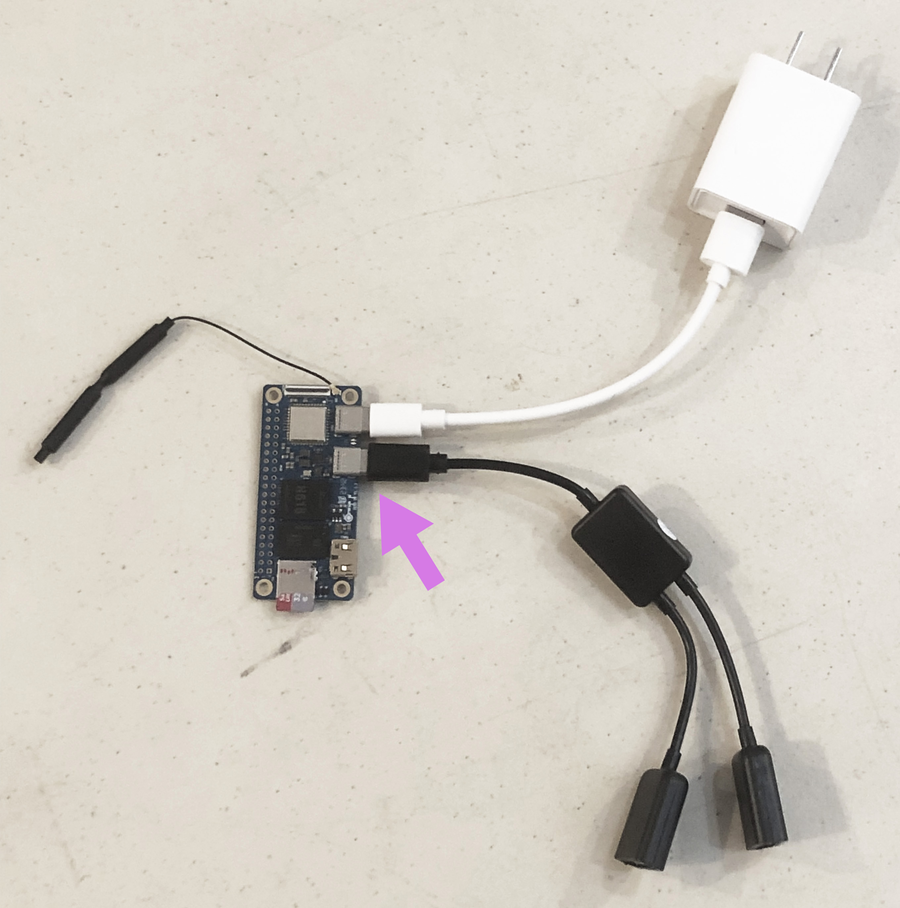
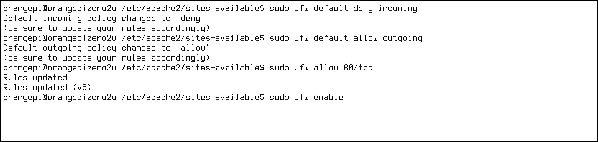
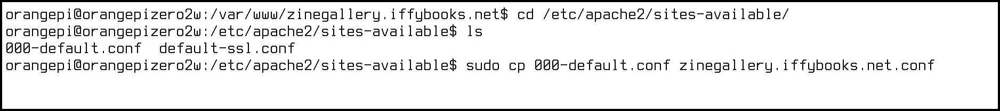
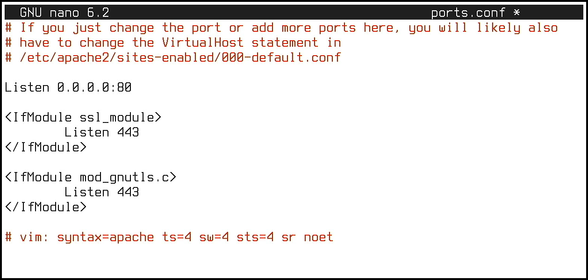
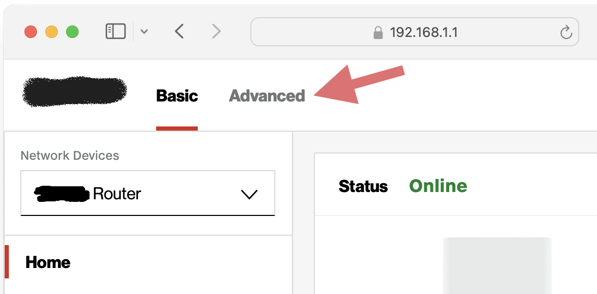
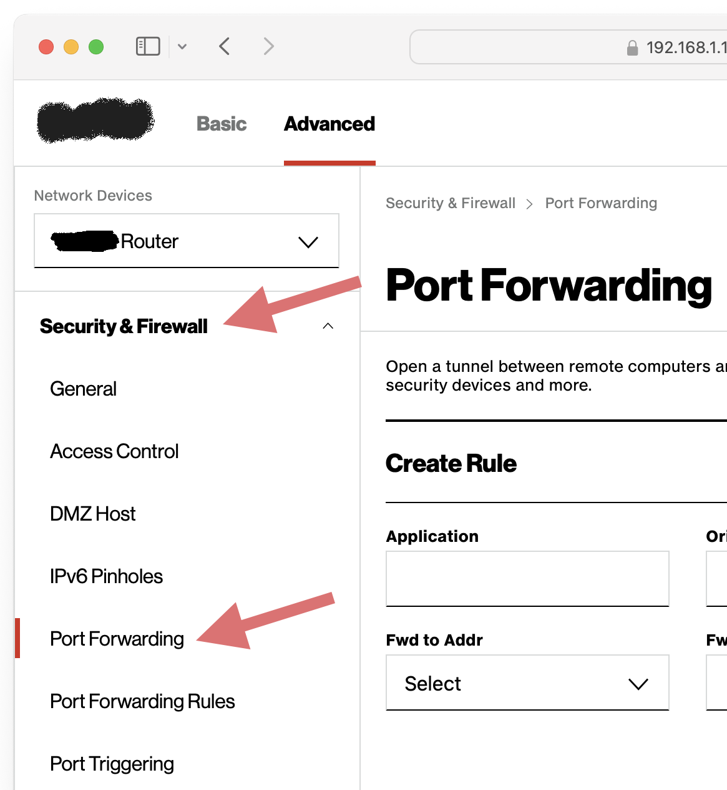
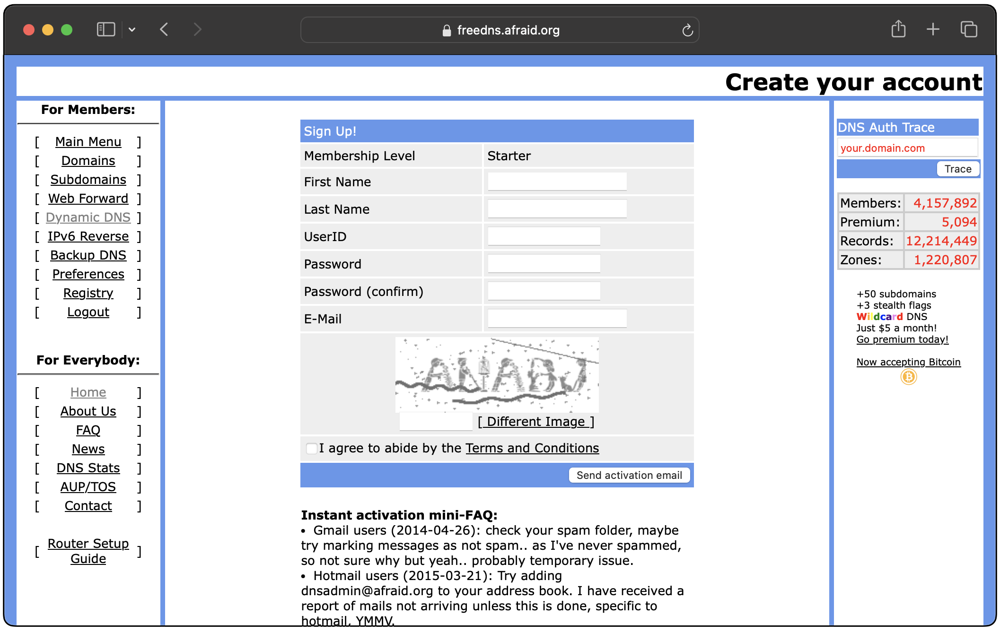
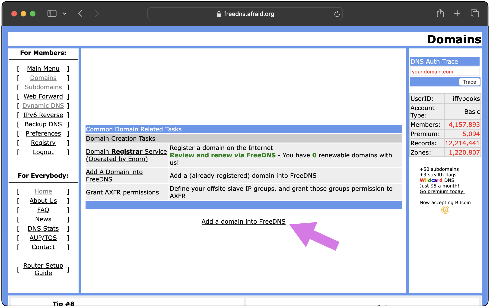

<div style="page-break-after: always;"></div>


<h2 align="center"><i>For the Model Internet Club</i></p>

<h2 align="center">Follow Iffy Books on Mastodon:<br />post.lurk.org/@iffybooks</p>

<h2 align="center">Support us on Patreon:<br />patreon.com/iffybooks</p>

<h2 align="center">Send corrections to<br />iffybooks@iffybooks.net</p>

<div style="page-break-after: always;"></div>

# Why  host a website at home?

- You control what you post.

- You can definitively take down your website by unplugging it. 

- Commercial hosting starts around $5 per month, so hosting at home may(?) be cheaper in the long run.

- Learning about networking is fun, and useful for future projects.

In this project you'll learn to set up an Ubuntu-based web server on a single-board computer, using Apache HTTP Server to serve your website. You'll configure Apache the proper way, letting you host multiple websites on the same machine if you wish. Then you'll set up a firewall and turn on port forwarding on your home router, exposing your web server to the open web. You'll finish by configuring Dynamic DNS (DDNS) with a domain or subdomain, so your website will remain accessible even when your home IP address changes.

The examples in this zine use the **Orange Pi Zero 2W (OPZ2W)**, an inexpensive single-board computer that uses very little power. You can buy an OPZ2W with 1 GB of RAM for around $20, but you'll need some additional hardware to get up and running.

We sell complete home web server kits at Iffy Books. The kit costs $49 as of May 2024, and includes the following:

• Orange Pi Zero 2W single-board computer w/1 GB of RAM
<br />• 32 GB microSD card
<br />• microSD card reader
<br />• 2 Amp USB power supply
<br />• USB-C power cable
<br />• Mini HDMI to HDMI adapter
<br />• USB-C to 2x USB-A adapter
<br />• USB-A to Ethernet adapter
<br />• Ethernet cable

You'll also need the following:

• A monitor (or TV) with HDMI video input
<br />• An HDMI cable
<br />• A keyboard with a USB cable

# ▶ Choose a domain

## Option 1: If you have a domain already, choose a subdomain

❏ If you've already registered a domain and you'd like to create a subdomain for this project, the only thing you need to do at this point is decide what subdomain to use. For the examples below we'll use the subdomain **zinegallery.iffybooks.net**. We'll update your domain records later in the project.

Each subdomain string can be up to 63 characters long, case insensitive.

## Option 2: Buy a domain

❏ Go to a domain registry website of your choice, choose a domain name, and enter your credit card info to pay. [Namecheap.com](https://namecheap.com) is one popular option, but there are many others.

## ~~Option 3: Sign up for a free subdomain~~

*If you have a static IP address, you can get a free subdomain from [freedns.afraid.org](https://freedns.afraid.org) or [dynv6.com](https://dynv6.com). However, we weren't able to get those free subdomains working with Dynamic DNS, which is needed if your home IP address changes often. If you know of a free subdomain provider that allows creating NS records, let us know!*

# ▶ Flash Ubuntu to your SD card

❏ Next you'll download the **Ubuntu Server** operating system image for your device. If you're using an Orange Pi Zero 2W, go to the following URL:

http://www.orangepi.org/html/hardWare/computerAndMicrocontrollers/service-and-support/Orange-Pi-Zero-2W.html

Here's a QR code for the URL above, in case you're using the printed version of this zine and you don't want to type it out:

<img title="" src="data:image/png;base64,iVBORw0KGgoAAAANSUhEUgAAAfQAAAH0CAYAAADL1t+KAAAgAElEQVR4Xu2cbZbrOI5tI0eUPYOumXX3zCJGkFkjqndVna7njnIIG+ThESjjrnV/CQLOB0hIYZu//ePXv4/+1wq0Aq1AK9AKtAJbK/BbD/St/WvwrUAr0Aq0Aq3APxXogd6N0Aq0Aq1AK9AK3ECBHug3MLEptAKtQCvQCrQCPdC7B1qBVqAVaAVagRso0AP9BiY2hVagFWgFWoFWoAd690Ar0Aq0Aq1AK3ADBXqg38DEptAKtAKtQCvQCvRA7x5oBVqBVqAVaAVuoEAP9BuY2BRagVagFWgFWoEe6N0DrUAr0Aq0Aq3ADRTogX4DE5tCK9AKtAKtQCvQA717oBVoBVqBVqAVuIECPdBvYGJTaAVagVagFWgFeqB3D7QCrUAr0Aq0AjdQoAf6DUxsCq1AK9AKtAKtQA/07oFWoBVoBVqBVuAGCvRAv4GJTaEVaAVagVagFeiB3j3QCrQCrUAr0ArcQIEe6DcwsSm0Aq1AK9AKtAI90LsHWoFWoBVoBVqBGyjQA/0GJjaFVqAVaAVagVagB3r3QCvQCrQCrUArcAMFeqDfwMSm0Aq0Aq1AK9AK9EDvHmgFWoFWoBVoBW6gQA/0G5jYFFqBVqAVaAVagR7o3QOtQCvQCrQCrcANFOiBfgMTm0Ir0Aq0Aq1AK9ADvXugFWgFWoFWoBW4gQKXDPTffvvtBtKNUfjHP/4xduMmd/33f//3x9fX18fn52c5xH/7298+jv//9V//tQRblrsTzy61njVcjZk0QTVPCWZVzKwXvc+rnOB5eqBzrSSRdx7o//Ef//Hx97//XaLTyiQHzj/++ENaYoa7E0/lWj9puAIzMb+apwSzKkbhRQ90lRs8Tw90rpUk8q4D/Xia/5//+R+JRo4kx1v6gVnxT8HdiadirUhDJWbieYSH5HBjJphITMSd8uqBTtTWxvRA1+oZZrvrQJ95mwlFWxDwn//5n7KPBRTcnXgq1oo0VGIm7RThITncmAkmEhNxp7x6oBO1tTE90LV6htnuOtB3XLwqL1TcnXiq1SIaqjCHi/RXAMFD8jgxEzwkhnAnvEgegmfHGKLPCl490FeoepLzKqNX09xx8aq8iN5oiPb0rYfkivBUrOXETDRU9LNSZ4JZFUO4k7VD8qgwV8tD9FmBuQf6ClV7oJtVHSunWnTRZ44EHf1ckuSK8FSs5cRMNFQMI6XOBLMqhnAna4fkUWGulofoswJzD/QVqvZAN6s6Vk656KI3zDOEv//++8eff/45RuKHu37CU7mWE3Mk9uwwWqFzhFl1nXAna4fkUWGulofoswJzD/QVqvZAN6s6Vk696I63zOP398fv8Mm/40+yx2+tVd+2/17zGc8utZyYzzwaHUardSZ9NRtDuJO1Q/LMYq16P9FnBfayA/0qQWZEJg2c4ZU91IJgnzmsYxYP4a7SUJXnoensIRvEmytisp6q+keV5wrNHjVJP7/qnysxq2oT7uo1qMI+m6cyrx7os+4+3a80euZPuIRS9rAOBR7nJuDwIqsh8cUZM+NplrvioJJDmxnMam1JP1fDrNKAcFeuQRVuRZ7KvHqgKxz+K4fK6OgLQirI9Es7KjzOTcDlBdVQ5Zkqj8JTyj2qpcqj0obmIf0ccae1qsUR7qo1WI17ZV490IXdojLa9RZCf1ajwuPcBFxeUA2FbSZJpfCUco9qqfJIhEkkIf0ccU+UKxVKuKvWYCniv8BU5tUDXdgtKqNJHhVs1cIkeFS1dsxD9HHGqHqsmhdODVXcnZhVtVTcSR4VZlUesnau4tUDXeWy8MmNNIwKNmk8FR5VrR3zqPxS5XF6Gr2l7viGTjGrdFb5rsrjXIMqzKo8xFOijwrPc54e6EJVVUaTPCrYpPFUeFS1dsyj8kuVx+lp9Dnyjp+hU8wqnVW+q/I416AKsyoP8ZToo8LTA32Fkv2GHqpKmly1WKrlCcUxBxB9CCTi6ZFHdWhM9LZPMM/GZA6NUek8i1l9P/GdcCd51Nhn81Xm1W/os+4+3a8ymuRRwSYLSoVHVWvHPCq/VHmcnj4wqw6NyR7go9Js5NAYlc4qDqo8zjWowqzKQzwl+qjw3OYNnQirEo0YRPBUy6PSh+Spxl2F5xX3mYNTiJazMaRXSQ2iIcnzPPSPk/aOE/eqa0h4EZ2Jhs48hNeOmKvxIniyMVu/oZMmzwryU3y1BlbhUelD8qgwV8tzxj17AAvRURGjWjvEC4pXdfgMreeIIzoTDZ15iC47Yq7Gi+DJxvRAh4pVa2AVHkhfEqbCXC1PJA79AlWUR3mdDAhSj3hB8qi+OEdqOWOIzkRDZx6iz46Yq/EieLIxPdChYtUaWIUH0peEqTBXyxOJQ3/iFOVRXicDgtQjXpA80ZfdKmpIeBGdiYbOPITXjpir8SJ4sjE90KFi1RpYhQfSl4SpMFfLQ8QhmEkeVQwZEKSWihfBo6pFeKliVLyceQh34kU1zNV4ETzZmB7oUDFnA6veVsiCgvSnw+gbFsFcyQsiDOVOcqlioh4jdZS8VL4T3M6YSGeqoUofkifSZ0fMEafHdefeQjFl4nqgQ7WcRqs+T1QsXihPGEY/RyaYK3kREv8VQLmTXKqYqMdIHSUvle8EtzMm0plqqNKH5In02RFzxKkHOlXoRRxpKtWmPQHz/9yqwkPyHIUVB3EQnVX6nOVRH8RBNCTcSZ4zL4h2Ge4knzImentUeUowK/0i9ZwxrrVM+pnorPKd1HJgznitwkPyZHDR2H5Dh0oRg1QN/IA0exAHwQPpD4WtOojjai+IGCPcSV51TPaQllW8SK8S39X6qPI51jLRh+j8ivOI76TWSswj3qnwkDwj+KJ7eqBHCv11nRikamAIKQxT4VHleX5QeRweEpIwB+xymMkxICodwPKMx2nZjF9307DaHqXaN0geVc9V0zDLqwc6VGxHo8lCcPOa+TMvtEoSVvVAmINctQNYKnia9euOGrrXcrTQnPtPhIVer6Yhxf2I64EOFdvRaOeCIvpEXxCCVtjC6Jd/bIB+FYo0dGOO8Di1odwjzDSPiluEh9Yha1C1JxBMqlokD8FDYqppSDA/x/RAh4rtaDRZCE5eFd7koN3/DKM/z8nknI2NNHRjjvDM8s3cT7lHmGmeDLaz2AgPreNcywSTc/8heEhMNQ0J5h7oWZV+xe9otHNBqfQZsGbpLYTXUgDfkqs8VWEmeFS1SB7iF8FM8hA8JIbgIXkIZlKL5CF4VLVIHoKHxBDuBA/JQ/BkY/oNHSpGDKpmdPTkT99EVLxIHmiHJYzqYwHzVxGiIelVFWaCR1WL5CHcCWaSh+AhMQRPlIf2qmpPiPAc1wkvojPJQ/CQGBUekofgycb0QIeKEYNI45E8EFIYFn02Rz8rVPEieUJSxgCqjxGSbJNUYa7mKVlfBDPJU0lD2quqPYFwV+lM8hA8JIb4TvCQPARPNqYHOlSMGFTR6DsdagGtkoRVPRCmWo8RPBJDYJId1+mshtleVewJxA7CS+UXwUNiVHhIHoInG9MDHSpGDFI1MISEw3Y/1AITFQSOHKAhKItTVOsxggeTEwTuuE5HNZzp1dk9gVhFeKn8InhIjAoPyUPwZGN6oEPFiEGqBoaQpGFXHQwyQoJ4MZL37B7VISQ76azW8Cwf8VS1vkieV1hVh9iM6Er0Gcm78h6iM+FF8qh4qPCQPCrMz3l6oENViUGk8UgeCEkWFn1RRlZIlMitoeoQkt10FtmF0hBPVeuL5DkDrTrEBgnzVxDRJ5PPEUt0JrxIHhUfFR6SR4W5B/qAksQg0ngkzwC84VuiL8kMJ154o1PDSB/Vl5EWyrVFauKpan2RPJFobt+JPhFm93WiM+FF8qi4qfCQPCrMPdAHlCQGkcYjeQbgDd+y41ujU8NIH9XPhYYNvMmNxFPV+iJ5IlndvhN9Iszu60RnwovkUXFT4SF5VJh7oA8oSQwijUfyDMAbvoVgHk6+6EanhkQfgofkWSTXFmlVGqryENGq1SKYnTGk550aEu4qPCQPwZON6c/QoWLEIFUDQ0iSsOgNVFJEmIS+GalKRvpQPKQ3VJh3zONcXwovnL7TWtV8JzqrfFdxV+EheVSY+w19QElikKqBB+AN3xJ9RjyceNGN9LNLVflIH4qH9IYK8455nOtL4YXTd1qrmu9EZ5XvKu4qPCSPCnMP9AEliUGqBh6AN3VL9BY6lVx4c/YADVVpxUEcpDdUeHfM41xfs15k+tBZq5rvhLvKdxV3FR6SR4W5B/qAksQgVQMPwJu+5fmgielk4gQzB2iooMwexEF6Q4V1xzzO9TXqxUgfOmtV851wV/mu4q7CQ/KoMN9moK8QZCanqoEzGLIHlYwcjkF4EczqJlcd9kKwk5isFyTn9xi1hmcYiO8EjzPPiKav7iG8HvfN+p6pRfhVWRcq3wlnZ0xlXlt/Kc5pIqnlNnrmT+WZwzEIL6KPcuNSHfZCcJOYGS9I/keMUsOoLvGd4HHmiTjR64TXkUvhO61FsFdaFyrfCW9nTGVePdCFneA0OvqyFqFFv2xDeJF6qo0r4k55EcwkJsJDctAYlYakHvGd4HHmIbxIDOGl8p3UIpgjPO51ofKdcHfGVObVA13YCU6jFW8G9OcwhBeRUbVxRdwpL4KZxER4SA4ao9KQ1CO+EzzOPIQXiSG8VL6TWgRzhMe9LlS+E+7OmMq8eqALO8FpNKlFqJHNxFmLYCZ4CC9Si8QQPCQPianGi+Ah+qjyEA1JjBMPqUUwq3QmtUhMNTwEM4mpzKsHOnEQxjiNjp7GIeQPspkQXlE95dsBwUN4RZjpdYKH5oriqvEieIg+qjyRfvS6C8+7rwuiM/XMFafq5xV4e6ALVXUaHX1eRmmRBUV4RfWUn98RPIRXhJleJ3horiiuGi+Ch+ijyhPpR6+78Lz7uiA6U89ccap+XoG3B7pQVbfRird0sqAIrzMZMwdxEDsIHsKL1CIxBA/JQ2Kq8SJ4iD6qPERDEuPA0+viA/2FkPjljFH18wrMPdCFql5h9OyBMCs3rpGDOIgdV+h8hovgIbxIDPGL5CExhBfB48xDeJEYFa9XtXpd/H9ViM7EL2eMqp9XYC470FeQrZAz08CzB0SoGk+V56F/FV7V8NxVZxWvu+ap1odOPBX25BUYMvu8sn4PdKWaIBc1WnFARLUN8JCnEq9qeFR+3ZWXSp9qear55cQDtswtQ+g+rybXA12taJCPGB194Y1+kabaxlWNVzU8Kr/uykulT7U81fxy4jFvv7ZyZJ9fAaYH+gpVT3ISo6Mvu9GfulTbuKrxqoZH5dddean0qZanml9OPObt11aO7PMrwPRAX6Hq5ECvtuE0nvMmaX1an58UIBv7O/ePefu1lSO+rwDTA32FqpMDXfWEfNc877wBko1C5XvrvNeDisp3VR7SP+bt11aOrNMVYHqgr1B1cqCrPsO6ax6yUZAFddc8Kt/vqs9deal8V+UhOpu3X1s5sv+sANMDfYWqkwP9uP2np+TsYRR3zEM2CrKg7ppH1T931eeuvFS+q/IQnc3br60c2X9WgOmBvkJVwUA/UjwfGjNzGMXd8pCNgiyou+Z5tN+s73fV5668VL6r8hCdzduvrRzZf1aAuWSgryDyrjlnD2l5XrxfX18fn5+fH3/729/++f/4eVz23wo8WQzKeLIwnRsXwaPiX42XE49Kw5V5KqzTlfw6d16BHuh5zcrcoTik5ezPa0f+P/74A/NdjQcDEQaSAeocNASPin41Xk48Kg0dea5apw5uXSOnQA/0nF5lolVfXNktj9sAMkCdg4bgUWlUjZcTj0pDVx562JRqvbt4dZ2cAj3Qc3qViVb9tGS3PG4DyAB1DhqCR6VRNV5OPCoNXXnoYVOq9e7i1XVyCvRAz+lVJppsbmTz3zGP0wSVhirMBI+qFukNVS3Cy4lHxcuZR6UhyePk1bW4Aj3QuValIlVP2rvlcZpA33qcg8a52Vbj5cTj7DNFLdqrqvWuwNw59Ar0QNdrasmo+ixstzwWcf8qQj+XdA6aHujODtinFu1V1XrfR5n3QtoDfWO/73hozGFH9BbhsCxzgE8P9HlHyIOKU+d5Rr4MmV49W1/ZPD6GXYkq0AOdKlU0bvbwkAetynmc0o8c4OMcNGTwqfSqxsuJR6Xhyjwjvape7yv5de68Am8z0CsfeDJzQETe8v3vIBv7XQff/u69ZkD8Ir6r9CF4VLUILyeeDC/VvpqpORv7jJnk2ml/fouBvsuBJ9kDIkgz3jGm2gZI8NzRByUnMrCcOhM8Kv6ElxMP5aXaV2k9RdzMx3k77M+3H+iqL4FEeRTNduSgX25R1dsxT7UNkODZUWcnZjKwnDoTPCp9CC8nHsIr2g8r7mMRZsK7Iq9n3Lcf6NETmernHqQZSAzFQ3LdNabaBkjw3NULFS8ysJw6Ezwq7oSXEw/hpdpXSS1VTISZ1Km+P99+oKsWC8lDGoLEVFu8BLMzhnjh1JDgceqzYy3il1NngkelM+HlxEN43RUz4V7Ni7d6Q1c1nuLpjjRL9SdAwmF1jMpTFU5Xb6jwVsxDNkniu4Kbew1G/ePGQzQkXhBPSS1VTKQzrVONVw/0b84RgxSfv5CGqf4ZDeGwOqbaZuLqjdW6XpmfrEHiu4KDew1G/ePGQzQkXhBPSS1VTKQzrVONVw/0gYF+3KJ6wvupcfpgB7akKm4mq3uDKbNvFNkkie+zCly1BlWHRM3yp/cTL4intJ4qTrFOK/J66NOfof9SImPQ8wEsqiabOSBChWGnPFU3kxW9sZMvM1jJGiS+j2KosAZVhzuNapC5j3hBPM3UVMXOrtOqvA59Lh3oqkMJsgcFfG+MygZFTZzlvvqQBJWnZ7zVm4kDc+QjvU64k1yk50mtanlU3B953nF9EQ1Jb5A8r2JW71HOvWVUg9H7LhvoqkMJ7v4nlDNjZ7ivOCRB5WnUzGQzIYPmqOPCHHGi1wl3kovoQ2pVy6PiftYbpMbO64vwI71B8kT72x9//DGbJnU/4UV6PlVUGHzJQI++nEC/BBLloTpVNugnDgruVGeiY4RHWUu16JyYiYYkhnAneUjPk1rV8qi4R71B6ih7PsKjrEW4kd4geaKYirxIz0e8Vl2/ZKBHb5b0ZxpRHipaZYN+4qDgTnUmOkZ4lLXIZkI8dWImGpIYwp3kIfqQWtXyqLhHvUHqKHs+wqOsRbiR3iB5opiKvEjPR7xWXb9koJNmIKKRPEQ4UovkccZU407wqHRW1VLluavvKn2ceYgXpA8JZlUtkofgIbxILRJD8JA8JKYaLyceos9zzCUDXfW0GeUhYrifAAkmEqNYUErukRfKWoQ7WXROzMRTEkO4R3moF6SWU+fIr4j3cZ1yd9YiuCM8lBepRWIiPCQHiXHzUvU84bYi5pKBrvo8KMpDBHN/RkMwkRjSeFEeJffIC2Utwp0MGifmyAt6nXCPclEvSC2nzpFfEe/jOuXurEVwR3goL1KLxER4SA4S4+al6nnCbUXMJQP9IKI6SGHmSfGqQyQURpLGO6uzgrvK00gfwp0MGmUfRphV1wl3le+klltn53p31iL94VpfBMvZ2qH3R3Er9qioprLno1orrl820A8yqoMUsgcFVDhEYtZM0nivaqzmrvL0TB/CnQ4aZR/OekruJ9xVvpNaV+jsXO/OWsR/x/oiOB4xWX1I7tV7lHNvIXyVMZcOdELEeeiHqpbjMAr1Zku8UMXM6ky4v8I6c2CFw1OiL+GeHbJfX18fn5+fpPy/xWRqDRW4yU2zPZ+RwVkrg2s21rEGyfpS7y2zujzfX3qgOw/9UNWa+TNd5jAK0ngVN1uFzoT72SLJ6HzkcXlKFjbhTn2f4fXASmsRbneNUfQ81cZZi2JSxM30ama9k/Wl3FsU2mwx0KMvXSi/LKGqFeUh5lFepPGqbbaRPkrukda0VoQ5qnNcp7VILpXvCl4H3mo9RjR0xkQ6K3vDWauShgQL1Zmsr6gerRXlGble9g09eiJT/pxBVSvKQwyivEjjVdtsI32U3COtaa0Ic1TnuE5rkVwq3xW8eqDHjkU6K3vDWStmrouIeJFKVGeyvqJ6tFaUZ+R62YFOhFUNLFUtkoeYRHiRWiQPwaOKUWEmeQhmoo+zFsFM8OzIi3DfMUblF+HurEXwqGIIL1LrHdZFD/RfnRA9AdInrigPaTr61kOanDQwxaSIi/TZVedIG8orynNcV/lO8kR4lLyiWrteV/U84e+sRfCoYiJetA7ZDxXrgu7hFHcmrgf6L7VUnz1FeagxqsYjeSgmRVykD/3sKcpDsRJ9FAuc8iK4CZ4deRHuO8ZEvarsDWctpxcRL4rFtS56oL9wRLVxUbNVhzYoniZVjUfyUH1UcXfU+Uwb9eEYqnVB8jh5qfqrYh5VzxNuzloEjyqm0r5KOF219/Yb+pM7qkMbZg9bIM1ANmSShzSnOuZuOr/SZ9XhGCrfSR4nL3WPVcun6nnCy1mL4FHFVNlXCZ+r9t6tBzoR9lWM6oCRkTyjG+ko1yvvG9HngXf2cAyiM1l0qjyveK3y5mpeV/qe0TR7UAnJreJerRbBo4oZ0VC1TkkewpOsQZInG/OWA/0hUubAgeMexaENqobJGn1lfFWdyaIjfpE8Z/2j9obgcfC6wneqpeJPuGe1VNwJH2ctgkcVk+Gl6meSh/Aja5Dkyca89UA/xKJfSom+mEHzqBoma/TV8VQfp85k0RG/SJ6Il9IfgsfFy+070dHlhYo74eSsRfCoYigvVT+TPIQbWYMkTzbm7Qc6/elN9ERP86gaJmv01fFUH6fOZNERv0ieiJfSH4LHxcvtO9HR5YWKO+HkrEXwqGIoL1U/kzyEG1mDJE825u0H+iEYEZ8YrcqTNXGXeJU+d82j8vGu+hBeREOylkkeEkMwq/A4axHuqhgVL1UewovUInmyMW8/0Hd9AswafXW8W+foLYziceVR+kM2ExUvMoyceIiOBDPJQ2IU3Ekd5YsJreeKU2ioWu+EM61FcmVj3n6g7/oZTdboq+PdOkefk1I8rjxKf8gGqOJFhqMTD9GRYCZ5SIyCO6nz7gNd1c9RHuIF3VtIrmzMWw/0zKEfZBMgi5fkyZpYPf4KnQ9NVIdsrM6j9o/0oUof0s9OPERLgpnkITGz3EmNRwyp5eSewX4WS3ip+vksD+GT2etIvmzMWw70kUM/yEIgjUfyZE2sGn+lzg9NVIdsrMizyjfShyp9SD878RBNCWaSh8SMcie5v8eQWk7uIxxe3UN4qfr5VR7CY2SvI3mzMZcO9NmDHTJGZ4X5Hu9cCISXCo+qFslDPCC8VLWeF+/X19fH5+fnx8ihFqo8hDvRcKU+pD6JuYPOhOermBHuqt4YxVzt4WFEQ9U6VWm4Is9lAz36Ug4hq964zmo6FxThpcKjqkXyEE8JL1WtA4/isCBVHsKdaOjQh+AgMZnDQ6rpTPidxWS4q3pjFvPjftJjDswZDVX9o9JwRZ5LBrriiweHGKSpVKI5mvOKxUI0JNxJHuKFs1bUh/TLLao8hDvRUOVFxItgITG76ky4RTGUu6o3Ijz0OukxF2aqYdTPNA/V6Iq4Swa64u28B/pvkn5RLUyShwAmm4CqVtSH9OcnqjyEO9HQpQ/BQmJ21Zlwi2Iod1VvRHjoddJjLsxUQ9U6pRpdEXfJQFcZTZpKJaoKM8FDeKnwqGqRPIQ74VWtlgozyUM0dOpD8JAYgpnoo8pDMKtiGvO8kioNSZ55tOsyXDLQoyclStcpPtlMKO6zOPq0qcJDNIz8opiJPs5aREOnPgRPpKHTiwgLvU4xq3ojykNxq+JIjyl6Q4VX5Vc1PJSXCveKPJcM9OizDEqULASaK4pzLSj6OY4KD9Ew8otijjQ+rjtrEQ2d+hA8kYZOLyIs9DrFrOqNKA/FrYojPaboDRVelV/V8FBeKtwr8lwy0A8iiqdkshBUojkWVOZQAhUeqqHqcBXih6sW0dCpD8Fzpl+mf4gPqnWqxKzqDcX+QzWM4kiPzfZGhIFez/bYap1VeLJ5qF7uuMsG+uNt7Pjt7/Eb4JF/ZCGM5H11z8oFNXIogQpPRkPV4SrEE0ctoqFTH4LnlXYj/UM8eMQ8e5G57yx2BrOqN1bwGtGH9Nhob4zgUffYCp0r9I9KW2WeSwf6GZGrG3hEZLIwM3lnD97J1HqO3eXQBoc+1TxdiWfEd7JO1ZhJXz/3xipeBMeOMRm/HDo78WT8muWeqUVje6BTpUBcpvGidKv/VBXVP65XPrTBpU81Tx14Mr5XHOiKw4IIL7KGdoyhPebS2YmH+qXgTmtl4nqgZ9QKYmnjRSUrfWmHflEkwkzzRNoc16NaJAeNqeapCw/1iww+FWbiWdQbSl4Ez44xxC+nzk48xC8Vd1IrG9MDPavYSTxpPFLO9fZJsNCfckSYaR6CKapFctCYap668FC/qg30qDeUvGgP7RZHesypsxMP8UrFndTKxvRAzypmGOhkkxTCDlORBUUwkzwhmF8BpBbJQ2KqYXbiIbWIFyQP8YLEqPCQPATPjjHEL6LPjnmIXyrupFY2pgd6VrEf4umTPykXPQGSHKoYysvZ5E59yKZEtCb6RHmoF1Ge4zrBQ7hHXigxO3kRfQie3WKoX0QfZ/+o8BC/qvX8M+Ye6MRBEEM/mwOprJ8RR3goL+eCij7DijhlrpNNieQj+kR5qBdRHuVAj7xQYnbyUvhF8FaLoX4RfcjaUfWPCg/xQ4WZ1MrG9EDPKvYifsWhBNFToAB2mCLDy7mgDuAufcimFAoJ34jP8mS8UOGh3FWHvRDcUYyqD0meCMtu1zM9RvRx9o8SD/GtUs/3GzpxDMTMHG4A0v/zTX3m4B1S41XMCC/3gjpwO/Shm1KkNdFH5UWE5bhO8GS4qw57IdjPYlS8SJ5ZrFXur7DeZ/uH+JXpZ+LNLGZSIxtz6Rv67MEgapufsTwAACAASURBVIOy4v0U7zhwgDQw4aPSkOBR1SK8SIwa8079rOZO9CYxsxqSGqQPq+mzI55XXowc8vPIM9sbxHfSP5VjLhvoij+ZVjTIdeAAWeCk8VQaEjyqWoQXiVFi3q2fldyJ1iRGoSGpQ/qwmj474jnzInN40ZFH0RvEd9I/lWMuGejRlwqoYNUMinjRL5wQ/mSBkzwqDQkeVS3Ci8SoMEe+EyxHjFMfFXfKLYpTaRjVoTpX02dHPJEXdD9U9YZzfUXcV12/ZKArnrbowlwl3Ku8ES/6kxCCmSxwkkfV5ASPqhbhRWJUmCPfCRZ3P6u4U25RnErDqA7VuZo+O+KJvKD7oao3qu0/kT4j1y8Z6KQ5CZlqBhFeKsykllNDgkfFnfAiMSrMJA/B49SHYK6Gh2hIYgivHfUhvIg+JIboQ/IQzM5aBHPlmG0HOn26c4ofPUkqMUe1CG8nHmUtwo3EkI3irhtO1D9uv4gXxFMSQzzdUR/Ci+hDYlR+EcyRFwSvu58JphUx2w50+vnLCtF+yhl91qPEHNUivJ14lLUINxJDNiWy4ZA8BA+pRfKQmKh/3H6pNCTcic476kN4EX1IjMovgjnyguB19zPBtCJmy4GeOQBhhWhnOZ0HDsw8ua7Q0Mld4SvZlMiGQ/IQvKQWyUNjKvml0pBwpzrvpg/lRTSKYlR+UczV9rpIn6uubzXQRw5AuEJY54ED2cNVVmvo5D7rLdmUyIZD8hCspBbJk4mp4pdKQ8I9o/NO+mR4EZ3OYlR+ZTBX2+tmNVxxf9mBnjX66+vrn6eqOf/NHJLgxElqZQ9tmOFeudZ3rUgfqja3Vz6pdJ7JQ/pnNmalhgTbjD6Ofh7Vx8mL6ExiZjCT/KoYxwFiWazbD/SZP8VkxfopPntIgqquKs+Mhlnuu9R6aHv1QH/gUOmczaPqsSjP6MCK8mavZ/Vx9fOsPk5eWc133FddB4hltdx6oCu+LJEV7Kf4Xb90odCQct+t1uF1lYF+YFHpTPOo1gbJMzuwSA0aQ/Vx9rNCHycvqnUURzFHeZTXI9+vxLz1QJ95OlYafOTa9WcRCg0p991qVRvoKp1pHvUaOcunGFgqvFQfZz8r9HHycnuhqkfyRL5TnUmtbMzWA13R5FnBzuLJ25yyniKXSkPCvWvNO6bSmeSZR8szqHqDVzyPJPqoMN+1ltMLVS2Sh/hOPCW1sjFbD/ToSSkrxmz8VSbO4FZpSLiThRBxoU+/Cl7OWhHvx3WVziQPxaSIU/ilwHHkoL4r+vmoR7xQ1HLzUvlB9FHVInmiXqU6k1rZmK0HevRZRlaM2fhqjUf4qDQk3BWbEv18SsHLWYt4pdz8iV8UkyJO4ZcCx5GD+q7oZ6WnEX83rwgPvb5br1KdKf9M3NYD/SAaPS1lxJiNrdZ4lI9CQ8J9dgPMHoYzw8tZi/qk3PyJXxlcitgZvxT1jxwZ32f7+YGZeDFb6wpeKk+IPqpaNE+lQ4eeMW8/0A8y2QMHqGnZuIqNRznMaki4j25KM4fhZHk5a1FvnuNUOpM8I/hm78n6NVvvcf+I76P9/B0z8WK01pW8VN4QfVS1MnmqHDp0u4F+ZgJZCKRhSJ5MMzzHVj9IYSX3kc3tcY/zYIfZWioNVb1K8mT6eVYfUotoqOY1u7cQXqqYDPfsYTgjGAmeKzzNcq++P/dA/9adqsYbafrne7KHP8zWo/eTRUdzRXHEiyOH82AHRS2VhkQfUovkibx6XFfoQ2q5eUWYCJ4oh/I69dT10QbBQzQkeaiOM9yr7s890IsO9APWlV+o+GlRkEVHF1QURxZv9AUqpYaqWioNiT6kFskTeXVcV+lDajl5qfCQPKoY4mnklwrLkYfgcXqq4K7cW5RaP3Ld4jP0M2FUDUPyKAy68icPuwz06ClbqaGqlqp/qm2SKn3I2iEaEn1ILRJD8JA8qhjCPfJLhaXiQFdwV+4tSq17oD+pSRaCc/ESPCuaYZeBTrxQaaiqRfIQTwkvUovkIXjuWkvFneRRxRBPiV/V8BBeBLOKuwoPwZyNueQNPXpSUj4FqWpFebLC/xSv5K7C5OK+41M99cu5mZBaqk3JWSvqQ+rFjusiwky5RxpGdeh1iqdS/1BuqrVD62XiLhno0WcZys8pVLWiPBnRz2KV3FWYXNwrDvSIO/WLbFzEL7KZkFokD8HjrKXygvAiMREekkMVQ/vQhZniqdQ/1AvV2qH1MnGXDPQDoPOH+apaq59uM4c/ZExWxK7m/sBIFotzE1D1KsFMfKqmD+FFMBPuKi9oLRLnWhdnWLL7xmrMGTxV+od4ndmjMvmUsZcN9IOE84f5qlorDr4YOfxB2QQ01wru32uTzd+9CSh6lWAmPlTTh/AimAn3R4xqLWdqnsU61sWr+jP7xgrMI3iu7p+RHlD38wiGn+65dKATIs5DAByHYxDOmZisPiT3qoMUyOIl+EZjVvEieK7mPvLg9DxAv76+Pj4/PwlVWcyVfslIdKJTBUbXxareIHh6oA829cyfhrKHALgOxxiU4uVtM/oQHFkNo5xksUQ5FNfVvAimKtwfWOmmtLrHiHZX+EVwdcy8ArPrQt0bBA9dO/Pq5DOUfUNXfHmDfjEjqkXz5OUfvyPCPJ75/96p5E4Wiwp3lEfJK6p1XK/E/cBDNiVXjxH93H4RTB0zr4BiXSh7g+Aha2dembEMZQe64s2A/nQiqkXzjFkwdleEeSzrv9+l5E4Wiwp3lEfJK6q160B39RjRz+0XwdQx8woo9gRlbxA8PdAHfCfCkrREfFKL5CF4VDEEs6qWirsTM+Gu4kVq7ch9R8zEi46po4Cqx1RrmeBR1Vrhwq3f0OmfFqM3EeUToMrECLOqjpI7WSwq3FEeJa+o1nHd5RfBoloXtJYizu2XAnPniBVQ7AnK3iB4eqDHvv5bhOrzOyJ+VEv5Gc2AFC9viTCr6ii5k8Wiwh3lUfKKah3XXX4RLHSgV8Ls9ovq2HFzCij2BGVvEDxkpsypMn532Td01VsNFV91+My4Ffk7V7/1ZQ6IIOjJYiF5ZmPUvCie1X5RHHSgq9ZgBter2Kv8msXd98cKzO4J6t4geOhMidnrI0oP9MebzfH71+N3sCP/MuJXO7CC8K1yQATBShYLyTMaM3LwxWitn+5b4dcIxtF1MVJr9J4Kfo1i7/uYAqN7wqreIHgya4epoIu6dKDPHuRCxH8l1cyhBNmDXFS1ZvLo2mUuE/GLLBZVngcbp6dnCqp4kTzqdeHglem+2b3lVW+sXoPVMK/Ak/HwEUv2hEze7HonuVf3BsFwxFw20BUHuYxuXA9xsocSzPzJVFUrm4c2giOO+EUWryrPwdnpaaSxihfJc4ZF3WMED/E90u95Xf/973//t/AsL8UetStmFfeZ9bVioCvwONcO7Z9H3CUDPfqyDf2SA9koIkForQhzVOe4rqpF8xBMzhjiF9nYVXmcnhKdVbxIngiPsscIHuJ7hPm4HnlKeany7IhZxT3KQ7Q5Yly9QfFEcbTHojwj1y8Z6NFTEv0ZAtkoIlForQhzVOe4rqpF8xBMzhjiF1m8qjxOT4nOKl4kT4RH2WMED/E9wnxcjzylvFR5dsSs4h7lIdooB7oKT4Sb9liUZ+T6JQNdtcBJHiIK2Uyq1SKYCXdnDNGQ8HLmIfoQzCRP8yIqncc4NdzRd4LZqSFxnGAmeQgvkofEqDCTWs8xbz/Q6dOU4ulOVYvmyTbD6vhIQ8qLLEyyoEieSBOKOcpzXCd4CK9IZ4JF+Wak4kVwR9ypX6o8BLNKHxVmVR7CK9KH+hXlOa5HvEgOEqPETOr1QH9SgH7eofg8SFWL5sk2w+r4SEPKi2wUZPCRPJEmFHOURznQI50Jll0HesSd+qXKQ7QmfUj6WYVZlYfwivShfkV5jusRL5KDxCgxk3o90P9SIHsowcwTnqpWNk+2IVbHKw7wIRsF2QBJnjM91F4QPISX6m2E1op6RskrqnXGPeuXolcJXqU+KsyKPISXc32p1oUbM+mhR8xb/sl95lCC7MEgqlozeTIN4YidPcCHbBRkGJE8r/RY5QXBQ3g9MGd79TvXTK2zvlHzIj0622OvNNzR9xnMsxoS353rS7UursBMev6IKTvQKYEoTrUpRXUqX88epFDhkIQs5pFhRDacTP/MYh7toRG/CPdRPCP3ZXQeyf/qnhUHpzi9GKml0u55OB6neB6neY78u8L3ag+fI7r9dE8PdKWaBXPNfEyQPYhDRX8G8wMD2SjIUCN5jpoKzLP6Zfwi3GfxZO6nOmdynsWuPjjF6UWmlko/Vc+7fY/4k3VRDfMzpx7okcMbX1d8CcT9BQ8F5sMysuhUi1eFWdFq1C/CXYGH5iB+0VxRXOQX1VCVR+EFxRxpQ69H3Gkep+8EE/GiGuYe6MTZG8Qo3hrdP8FQYHYPdBVmRctRv8jGpcBDczg3ycgvqqEqj8ILipn6EcVF3KP7H9edvhNMxItqmHugE2dvEEOak9B0NrATM6lFuJM8RGdVzF0xq/Qhfqk0VOUh3EktkofEEA1JHidmgofwqob5bQa6+6mVNIwzhjQnweNsYMWTP/Wd6EO4KzATH2gMwUy403qzcdSv2TqP+yO/KB5XHsqb+E5zRXER9+j+fkOnCuXibv0ZuvtzpZz066NVm7Zzo1B8Nkd9J/oQ7grMym4gmAl3JaazXNQvFZ7IL4rHlYfyJr7TXFFcxD26vwc6VSgXd9uBnj1EIifbHtGqTdu5URzKzjz9Z3wn+lDuM5jV3UQwE+5qXK/yZfxS4lEcnHLWq1leiv4hvjs0zNRwY46wkXVRDfMzp9sN9JmDFCKzd7tOmpNwuqKBs4eijPhO9Mlwz2Im2o/EEMyE+0htes+IXzQ3jZs9OOVRZ0UeyuE5jvg+kvfsntmevwLzGR+yLqphvs1AzwirOkSCLIgVB4yMHCJBmpPwyehM8jljZr1wcnf65ayV8XvWr1e1RtZOBjOJnd1/Rv26kjvBnFlfsxoSn9SYSU1lzNZv6LQZVIdIEOEVfzo7q5M5RII0J+FEdSa5nDEKL5zcnX45a1HPFX6p1g7FTOIU+8+sX5l9g3AiMQQzXV8KDd2YST11zO0HevTlDfoFGCJ8VIvkIDEUM1lQpB5ddCSXK0blhZO70y9nLeK5yq+oFl07UR56PeJF8Sj8orUotyiOYCbrS6VhhPe4rsJMaq2Iuf1Aj5766U9UiPhRLZKDxFDMpDlJPbLoSB5njMoLJ3enX85axHeVX1EtunaiPPR6xIviUfhFa1FuURzBTNaXSsMIbw90otCLGGI0SU2agdQieQgeUovkITEEswoPqUUwO2N25O7E7KxFfFfhIbWc/Ux4ETwkzztzJxoSfYjOqloETzbmkjf06ImLkKBPm1EtmodgimqRHDSGNBVpzqieUp+olvK6wgs3dydmZy3iqwIPqXPEkLVDc0VxES/aY1GeCMfjupM72X8Inog71ZBo5KxF8GRjLhno0WcihAT9PCiqRfMQTFEtkoPGkIVAFlRUT6lPVEt5XeGFm7sTs7MW8VWBh9RxD/SIF+2xKE9F7mT/IftYxJ1qSDRy1iJ4sjGXDPQDZPQkdEZEdWhDNg8Rd4YXyZ950iYLSqlzBr8jdsaLFb1BODsxO2ut5k7yZ9ZOJl8Uu/oQm6j+83UyQDP5zmLJ/kPxqDQk3Jy1CJ5MzGUD/QCZPZRg5jAK1eEPRNwsL5LzewxZCGRBvao9o/MIl5X3ZL2owN2J2VmL+JzFQ3KOrJ2RvGf3qPafWX3IvqHiTvafDB6VhoSfsxbBQ2MuHegUZKW4KocbqDTJLChS81kfEj9z8IXDiwcHZy2iW7UYh+9kQIzqUqEPZ3uM6JNZ7w48r/ya8YL4P8ur8p7QA510wF8xlQ43SMA+Dc0s8KjmzJ9wswdfuLw4ODtrRRpXvO7ynQysWX2u6kNFjxF96Hp34TnzK+sF8V7Bq/Ke0AOddMGvGOeXJcjChLDDMLrAo0SRPtH9x3X65ZaoFs1DMDlrETzVYiJ9CF7ql2tdUDwRd3ceog9Z7ypeBE/UH1TDKM9xXcVLlYdgzsb0QIeKRW8hyp9OKBYCpCX7CU+kD8FDNYxq0TwEk7MWwVMtJtKH4KV+udYFxRNxd+ch+pCBruJF8ET9QTWM8py9VT/upbVU+hDM2Zge6FAx0pxksZBypBbJQ2KqYSZ4iD4kD9HHWYvgqRZD9CGYiV+qWk48Kl53zaPyguQh/ePUmWDOxvRAh4qpmoGUI7VIHhJDGpjkiZ5aSY4jhuCJatEnbYKJeEEwk1o7xkReUE5EQ1UtgkmBh/ZhxMudR9XzJI/KC5KH4HH6TjBnY3qgQ8VUzUDKkVokD4khDUzyRJ8rkRx0oEe1lJ+7ES9UGlKNKsVFXlCsRENVLYJJgYf2YcTLnUfV8ySPyguSh+Bx+k4wZ2N6oEPFVM1AypFaJA+JIQ1M8hwx0ZsGyUPxuA5/IF5QzIT/jjEVfFfrRj1V9WGlPKqeJ3mIb9SLKBfBQ2up/IowZ6/3QIeKKZshKklqRTnoddrANJ/z4AvH4Q/EC7WGVOtKcVf5vkqDjKeqPqySR9XzJA/xL+PFWT6CJ1NL5RfRgMZcOtBVP/CnZKO47OEYUb4drmcaeJaPekERPA5PMxo68BBdRmNGDv0gvr/C46xF9BjBQ/JWixn1y8ljxAvCK7OWnXxprcsGuuoH/pRoFKf4s2FUo+J1ZwO7F5TLU6qhC4+jzzKHfhDfzzA7axHtMnhIvmoxs345+WS8ILzoWnZyzNS6ZKCrvgSSIXoWG+FR1amYx9nAzgXl9JRo6MTj6jP6ZS3ie4TZWSvCclyneEiuajEKv5ycqBeEF1nLTm7ZWpcM9OhNhf5MI0v2p/gIj6pOxTzOBnYuKKenREMnHlef0XVKfI8wO2tFWI7rFA/JVS1G4ZeTE/WC8CJr2cktW+uSgV5NWIInK+wu8c4GJjqr8JBaKo8IZiceFS+Sx8ndWUvFneSpFrNjr6p6g+Sp5tcznh7ov9TYsYFVTeVs4OgtlT5pE+4uTylmFx6ijTKG9I+Ku7NWpBH1PcpT8brKLyc3VW+QPE5e2Vo90HugZ3tmOD76HJl+FkYAuDYlitmFh2ijjCEboIq7s1akEfU9ylPxusovJzdVb5A8Tl7ZWj3Qe6Bne2Yq3nUgg2NT+v333z/+/PNPpIcDDwIiDiIboIq7s9aZTBnfxXJb0qn8soD9q4iqN0geJ69srR7oPdCzPTMd7ziQYeWmdPy59fgd7MGD/luJh2JYEUc2QBV3Z61XWo34vkLz1TlVfq3G+Zxf1Rskj5NXtlYPdDjQnUaTBUXwqPJkmsp5WJDjkBaiM9GHeEHyqPCQWgQzwUPyEDzOGMLrgSfbhyOHoryqNZPnTEviV0afWd9UeFR5nF5kteuB3gM92zM/xjsPC4q+YKcipdq4yGZCMKvwkFoEM8FD8hA8zhjC68Az04eZQ1HOamXzRDoSv6g+US1yXYVHlcfpBdHnOaYHeg/0bM+8jHd+4S2qJSH0VxLVxkU2E4JbhYfUIpgJHpKH4HHGEF6KPqRfrotq0TxEQ+IX0YfUIjEqPKo8Ti+IPj3Qv6mkMjor/k/xKjyqPIRX9Kai/JlPVIvgpTGqjYt4QTCp8JBaBDPBQ/IQPM4YwkvRh3RdRLVoHqIh8YvoQ2qRGBUeVR6nF0SfHug90P+lgGphqhYLaWBSi+QhMU59nHhILaIz0YfkIXicMU5eqlokD9GQ+KWq5cSj4qXKQ7hnYy75k3u1J5xqBqnwOHV21iL6ZBfCT/GqjUuFWYWH6EMwEzxRbxAs7hgXL/pmHWlI8xAdVb6TWiRGhadaHsI9G3PJQK/2GYTK6Kz4P8Wr8Dh1dtYi+qi8IBs7qaXCrMKjwkzwRL1BsLhjXLzoZ9+RhjQP0ZH0KtGH1CIxKjzV8hDu2ZhLBvoB0nXACBFEZTSpRWKUeJw6u2oRfYjOJEa1cakwq/AQ7gQzxRO9YRI8zhgHr+wBNZXWF9VH4ZmqD6vlUWjzPcdlA/0A4jhghIimMprUIjFqPE6dHbWIPkRnEqPauFSYVXgId4I5g+e5N0j9K2NW8po5oKbK+sroM+ujqg+r5ZnV5dX9lw50FaHswQ4jdTMNPHu4Cmm8VxxWHTQxotfKe4g+xC9VngfXd+xDojPpBeIFybMyZpf15dh/Mr5XwePssYw+yp7dfqC7/pRHDVIcrjLbeOqDJpQNp8hF9CF+qfIcnN61D4nOxHPiBcnjiKm8vlz7D/W9Eh5nj1F91P269UCPviiiFIsYFOGhX1xRNB6tpdTIlYvoQ/xS5Yl8V+pCeEV4aG+o9CH8SS2SxxVDNXThOepU870aHmePkXW6oje2Huiut6JDeGJQhIf+tETReLTWiqZanZPoQ/xS5Yl8V+pBeEV4aG+o9CH8SS2SxxVDNXThIX8lopiJFzv2IeGl8ovoo6r1nGfrgV7NIIKHGE3ykGYgtUieajFEH8LdmUelYTVeBA/hTrwgeZwxKu4qzERDgvmd86i8IDqrat1moEdvIkrBiEERHuUTMuFGMJM81WKcOhMNyQao0pDgqaYP4e7UkOAhMcQLkkcVU8333fCofDjyXNUbW7+hR5/RuA2K8NDP3VSb21VNpdT9VS6nzkRDlV9EN4Knmj6El1NDgofEEC9IHlVMNd93w6PyoQf6hJLRU+BE6v9zK128isMfVJsbxazSyJnHpTPRUOUX0Y/gOfJU0ofwcmpI8JAY6gXJpYqp5vsueFT6P/Jc1Rtbv6E/xHMcWJExaPbwB9XmlsGsbmhHPofOREOVX0QzgufVuhg5zITwyuA540dqEX2cMSruasxV1kXVPqw2L5T+lx/os4cSELHIZuJcvAQP4bVDzJWHdRCdie8kj8oLgkdVi/DK4Jk9eIfUIphV+hA8qlrPw/Hr6+vj8/PzY9XaIRo6uTce3kWlB7riUAIixY4NQ3jtFHPFYR0q30kelRe7bqSKj8YI97t6cfRP74c/ryLSG6o1SHrMieeZV9mBrvpCBTGxmkEED+G1Wwz90qCKF9GZLEySR4WZ4FHVIrwInmgtU7ykFsFM60VxBE+Ug16PNFSuHaKhk3vjoV3y8VF2oEdP9PQnYESKHRuG8NotRukp4a7yneQheEjMjhtptJYJ7yOGcL+rF5GGyrVDNCReUF+juMYTKfT/r5cd6E4TnbWINQQPybNjzI4bhdOvd9aHcG8v5lc90ZB4MY/kfzM0Hq5k2YHeT6TcxDtFOjcKVY9FeZT+OPVRbaQKfegbqKIW9cvpRcSL6kO4qXwntUhMNTxOL4g+zzFlB3p/ZpS18h7xzk1S1WNRHqUzTn1UG6lCH/oZsaIW9cvpRcSL6kO4qXwntUhMNTxOL4g+Wwz0A6TiUAIiSLWGIXgIrx1jnJuksseip3aVF059SB9SPDP6/P777x9//vknlnCmFi7yK5Byz+Q8i+398Gd17upFtnfKvqE/iMwekkAEUW5cpF4UQ/BEOXa97l6Yh06qHrvbgRWkDzN+ZfUZOQzn1b6xai1kuKswqHr1DI/a91nu1fA4Z1NWu0sHuurQmNk8pGGywt4pXrVxEZ0ztbIHlcwcxNE9xjt6RmdeZW0k6dVXCGa4z/aYSpFR7qr6I3ky+wbJX8ULgvU55rKBrjokQZFnxwbOGj0Tr1osRGdaa+bPqtlDbLrHxronq/NYlTV3kV49q5zlrugxlRKz3FU4MnnovkFyVvKC4L18oKu+VKDKs2MDZ42eiVctFqIzqRX5TrjSLxFFtWgewp3g3i2G6lONl8Ivyl3VYyoNFdxVWGgesm+QXNW8IJgvH+jR2xX9CYYqz44NnDV6Jl61WIjOpFbkO+HaPUZUmo+hOs9X0mYgvRpVpNyjfqZ5Ijz0uoI7raWKI/sGqVXNC4L58oFOGoYY5MyTFfZO8cQLwreaX4RXNcxE52oxROdqmInvBDPhTmqRPAQPiSF4SB5njEofwl1Va4U+l3yGrnoKUuUhJq4Qf5ecqgYmOpNaJE+kLX3rUfVYlCfCu+t1qnM1fjv2mErD3XpV2WMRd2UtlV+Xv6GrPqdQ5VEs3hXmVMlJhizBSnQmtUieCI/7882oVyO8u16nOlfjt2OPqTTcrVeVPRZxV9ZS+XX5QD8AqA5JUORRLN4V5lTJSYYswUp0JrVInjM8qoNKVHmIdjvGZPWpxHHXHlNpGL2pqurM5lnRY4qZMstr9P5L/uT+AKs6JGE2z+ziHRV/l/vIkCVciM6kFsnzCo/qoBJVHqLZjjEz+lThu3OPqTTMHgSkqkvyrO6x2ZlCOKyIuXSgE0KOH/iTxUsGDeFDYggekmdlzMgBGoQX0VmVZ6U+V+beWR/nYUFnHt1Fw5F16uxdtc5V+sep4XOt0gPd9QN/dVPNmknwzNZQ3Z85QIPw6oE+74xK53kkuQwzf+bN9CFBdTcN1foQDUmMUudK/UO4r4gpO9CdX05QNpXCJIJHUUeVg35RhPDqgT7vikrneSQ8Q7TeSSbahyTXHTVU6kM0JDEqnav1D+G+IqbsQI+etpQ/H1A1lcoggkdVS5GHekF49UCfd0Sl8zwSniFa7yQT7UOS644aKvUhGpIYlc7V+odwXxFTdqCrjCaiOWup8JA8zhjnIK7ml1NnUmtHfQhmwp30IclD8KhqETwk5p0xE+5Ew2qeEszPMT3Qf6lBmsFptOJpM9sIM/H0yT/i5c4zw7nyvdX6mWgV9QbJccSo1mmEh/Yqxa2I29F3FWaSh2is6h9Sa0VMD/SCA13xedCKZvkpJ/1sLuLlzuPUyFmLbG7VNq6oN6h+Kl4RHtqrFLcibkffVZhJHqKxqn9IrRUxPdALDvTD6OgNYUUzjOTMHuygOrRBlWeEc/V7yOZWceNS9LyS1249tqPvKswkD1m3yv4h9dQxPdCLDvTD6Lse7KA6tEGVR72oxTIA6gAAIABJREFUrs5HNreqG9dsz6t57dRjO/quwkzykHWp7h9SUxlz6UDPHgJAiI8cpKBqBoLvVcwI5tFa73af6mCiFXmIFyO9QfpZvXFl1/IqXkTTK9ZgVp9RHn3fNQqM9PMKpJcNdMWf184EyRykQDbAFeJ/z5nB7MCzew3VwUSr8xCdM71B+lk50GfWspoX0VK1b9BaM/rQGh1XQ4FMP69AfMlAj75woiJKv7hCNkAVpigPxRzleffrUY9RnV15iF8UM+ln1UCP9HHzIvWiGKpzlOe4rtCH1OmYOgoo+yfL6pKB7npipT8tIRtgVtjReIp5NP+73Bf1GNXZlYf4QjGTflYN9EgfNy9SL4qhOkd5jusKfUidjqmjgLJ/sqwuGehkw8kS+SmebFxOPIQXwUzyvHMM8ZTo7MxD/HJiJniIPiSPihepRWIIHpJHpQ+p1TF1FFD1T5bRJQPd9dRKn5RceKg5VzUDxbdDHNlIic7OPERXJ2aCR7F26DolXhDMJIboTPI4MRM8HbNeAdrPK5BcMtBdnyvRzzJceKiBqs2E1rtjHNlIic7OPMQHJ2aCR7F26DolXhDMJIboTPI4MRM8HbNeAdrPK5BcMtAPIoon+zNBVAeerBA9yqnaTKI6d75ONlKiszMP8cOJmeCZXcuZdUq8oJijOKJzlOO47sRM8HTMWgUy/bwCyWUD/SAze4jEK0GOP3ccvwk8cmf/rcCTxXDEqzaTkdp3uYdspERnZx6ivRMzwfOIya6dkXVKvMhgPoslOpNaTswET8esUWCkn1cguXSgryD0U07VwSCzmMkCz2wmKl4r8hCtZg5kmD2sg+hM/CI8d4iZ8ULFr7KnI/qQ/lH1oSqPyktVnmq8CB4V92yetxjoqoNBsuK+ilct8CO3itfqPES37IEMio9syMIkfhF+O8VkvVBx28XTjD6kf1R9qMqj8lOVpxovgkfFPZvn9gM9+tKO+wsMqgWu4uXKQxqTehFhJrWOGLIwiV+03k5x1AsVp908pfqQ/lH1oSqPylNVnmq8CB4V92ye2w/06Knf/RMD1QJX8XLlIY1JvYgwk1o90M9Vol5QraO43Tyl+qjWuzNP5JX7OhmgRB8VboJHVSub5/YDnRjtNEiFZ8c8pDmJF4R7tVoET7UY4oUK846eEn0Ir2p5VJ6q8qj0ceJR1crmuf1Aj5786ZN2Vtif4lV4VHlUG06Eh+rnWrzUd6IP5bZTHNVHxUnRPxSzsxbpH9LzEWYnd5XnJE81XhQP4bYi5vYDPfpsjn4WphJfhUeVR7XhRHiofmRzI5ijetR3Ra0IS8XrVB8VdkX/UMzOWqR/SM9HmJ3cVZ6TPNV4UTyE24qY2w/0Q7Sfnm6vOgRAhUeRR7XhnOmcaVyyuRHMZzUzvs/WynCvEpvRR4k5egtVeTrbqxl9SP+QnlfuYzM6K/2OcmV0nvU0wnJcz+IhOdUxbzHQD9GeD76ocAiACs9sHuWG813nkWYlmxvB/Kr2iO+jtUa4X33PiD5qzI4Dah6YHbVI/5Cef4V5xq8sd7XPZ/mq8ZrB49TtqHXpQM8eIjFysENG0CweknsGs+qwlzOc6g1nthbRlMRkNslZzKpahBeJUXtabV0QDarEqL1w8NoRs0OXHWpcNtBn/uyTOdiBmjCDh9TIYlYd9hJhcy5eUivCS6+rhizBrKpFuUVxSszV1kXEvdp1pRcubjtidmlTvc4lAz36ggcRTfnlBAUeJeYIj5K7c/GSWkRHEqMasgSzqhbhRWJUmKM+JFhIjLKfST1njMqLxuxUYN9alwx0xVO/8ucDCjykBSjmCA/NQzA5NxxSi2AmMaohSzCrahFeJEaFOepDgoXEKPuZ1HPGqLxozE4F9q11yUAnTU4kVW2kKjwqzASPk7uzFtGQxDgxq2oRXiRG1T8kD8FDYqppSDCTGKJhNe47YiZevEPMtgNd+VRf7U0kwuPk7qylWnBOzMpaKv6q/iEbuwJzRQ0VvI4cRMNqA13VPyoNOw9XYNuBrvzcrdpnhREeJ3dnLd6255FOzMpaKv6q/iHDSIG5ooYKXrsOdFX/qDTsPFyBLQf6ih/4R0+lXNLXkVnMikNjKOYKtSjWKC6rc5TvuO7Uh+AhMQrMjoG+wi+ijyuGaFjtDX3Xnnd5WrnOVgN99Q/8Vxy2MIN59tCYTONdVSuD8Sx2RmeCwakPwUNiZjGTYURwvIpZ7dcoLvV9RMOKA/3QYbZ/1Fp2vliBsgM90+TZgy9mDnuJJb1vhOOgG7V6d+0NlRdZfb77k1mnKm+v4j6yb1wx0LOejvB6eKnyQtUb755n+4E+86fy7GEv79wsroNulBrftTdUXszo8/DJPdArcM/sG+6BPuNphtfZn+WzeZRr/t1zbT3Qoy9vEHPv/IUcwp/ERDpX1DDCTHjvyItiVuhzaOgc6BFmJ3dayznQI32UPR/VovoQTB3DFdh6oM88jT4kuvNPZngbnEdGOlfUMMJMtNmRF8Ws0Mc90CPMTu60lnOgR/ooez6qRfUhmDqGK7D1QCeLhUjhfMsgeKrFEJ2raUgwE5135EUw76gPwVyNuwoz6VVSi+RRaUjyEDwdwxW4ZKCrnu6iPESGfpKMVSIbRbXFSzDHzL1/UiZ4CC/ihWLtuN/QVdxJHuIF0ZnUInkIHlKL5CF4SC2Sh+DpGK7AJQNd9flLlIfI0J/1xCrtuHgJ5pj5fQe6Yu30QP9H2EKkD1WDj9QKAf8KIHhILZKH4OkYrsAlA/2Apzj44iwPkeDuh1oQDUjMjouXYCbcq21KhBfFrHhLp7WI1lGMijvJE2GhDzOklkpDUmtHXgRzx/yvApcN9KO46uCC7IEw73KoharJyUah2pScmEmtHXllMGfXznfNMrWI3mcxqj4keQhWwp3UInkIHlKL5CF4SC2Sh+DpGK7ApQOdw/REqg5JyB7soGKnOiBiBE9m8V6lj5PXlV684jmCh2zaI5r2Pe+hwNV7wkjPP5zJ7lEztZTd0AP9LzUrHFihMjZ7sIPzT6+KWiqdSB66Ke3SP5ne6IFOOqRjflJgdu2olM30/FFzZo/K1lJxfOTpgf5LiegLQvSLc1EetXln+dyYyeKtpA/1QsHL7UXEjeLpgR4p2dfPFFCsHZXCtOcVexStpeL2nKcHOngioz9tm3myU5vrxkwWbyV9qN4KXm4vIm4UTw/0SMm+PjvQXXsC7XkFHlprRff0QP+lKtm4yMZO8qwwceZPXirMO+pDvFDxUuUhmElMNTwEc8fspUC1HnPiIbVWuNkD/aZv6EezkKZSPJHSWqqHhxUL4VVO+qRNeBEvSB4FdyUvBZ7OcU8FKvU83aOc++EK13ug/1I1+tyEfiYS5Vlh4OyfvFSYqy1ehdbUdzKIK+mj5KXQuXPcU4FKPU8HunM/XOF6D/S/VK1w0I3aYLKgjpqKp1JSiww+tQaj+TKHDhFeVfRR8xrVt++7vwJVev6hNMHj3A9XdEAP9CdVrzroZoWx9In0UdtxwAgZfKu0oHlHDh0ivMhmQvJQHt/jVvEaxdP33V+Bq3v+u8IEj3M/XNEBlw70FQe5VPmB/4xZqo0908BneFV4ZjR5vlfFK4Mne9BEJrc6NqPPLK9MLUePqfAQT1TrgmAmtUieu/Kqpo/KC+LXc8xlA331QRxX/8A/a8T/MeW332Zu/9e9qqYii0UCGCZR8YLlJB9J0FqKOKqP66MWwknVY5Q7wRTFODGTWirupFakzXGd4CG1nHkILxVmUisbc8lAj754QL+0o8qTFW11PGkYgoEsBJJHhYfUIjEqXqRW1GMkhzuG6KPiRWoR/qoeU+Gphpnoo+JOahF9CB5Sy5mH8FJhJrWyMZcM9OjNgP6sRpUnK9rqeNIwBANZCCSPCg+pRWJUvEitqMdIDncM0UfFi9Qi/FU9psJTDTPRR8Wd1CL6EDykljMP4aXCTGplYy4Z6CpBVHmyoq2OJ7wIBrIQSB4VHlKLxKh4kVrVuBPMRB8VL1KLYK6Gpxpmos+OXqh4qfKofFd5QfA8x/RAzypmiFe8PdG/chA6ZLGQPKoY52Kpxp1oSPSp1mPV8BCdFZiPOgq/lOtdwYviIeurmj4qzKTHsjE90LOKGeIVn2/S7yEQOqSBSR5VDFngqlrVuBNeRJ9qPVYND9FZgZkO9KiWcr1HtYg2FA9ZX4p+pngINxVmUisb0wM9q5gpfuYpOXN4CKFDGpjkUcWQBa6qVY074UX1qdRjB69qeIjWM5gf+Wf9Uq93pxdkfVXTR4mZ9Fgmpgd6Ri1zbPawl5HDQwgl0sAkjyqGLnBFvWrcCaeMPlV67MGrGh6idxbz95yjfq1a704vyPqqpo8aM+kxGlN2oFMCq+JmDqhRHZizils2r7OBSa1X+Gf8OtOD4MlsOFntv8dXw5Phc7d1Qbjv7BfhR2KqHF5EsD4/zHx9fX18fn5mbvtXrHNPeAbYAz2wK3tAjerAnKEuWnSTc1Mitc5oZv2KJCN4nIu3Gp5Iv8f1O64Lwn1Xvwg3EuP8SILgITE7Yn7w6oEOHKZfqIi+TELzAEjWEOemRGpF5JU6Ezw90M8dueu6iPrwuF6tfwhmVUzkO63jXF87Yu43dNpJf8XRn2BET3Y0TxLe8nDnpkRqRYSVOhM8zg2nGp7Ii+P6XdcF4b6jX4QXiYl8JzmOGOf62hFzD3TaSU9xpKnuunidvEgtYh/xi+QheFS1dsRzV8yEF4mp1j8EsyqGcCe1qq2vaph7oBNHnmLoG1/0dEfzJOEtD3fyUmwCSp0JHueG4/RC1Vg7YlZxr9Y/Kl4kT+Q7yaFcy6Tejph7oBNnn2LoZ7LR5y80TxLe8nAnL7IBRoSVOhM8zoHu9CLSmV7fETPlFsVV658Ir/J65DuppVzLpN6OmHugE2f/iske2vDTE142TwKiJdTFi2yAZ4TVOhM8zoF+cHd5oWysHTEr+FfsHwUvmmPmjVe9lu+M+cGtv+X+g8szhzY8HzQxk4c2oCvOwYtsgK/4rtKZ4HEP9IO/wwt1X+2IeVaDqv0zyytzf/bgnVVr+e6YD363H+jqzdZ5OEb2QIaZw1Uq8/q+EDOezvJSb8izeDKbEolV4amWh3BXxWTX6ZX9rOLceWoq0AM94YvzcIyZP1VlD1fZhdfDKjrQFbyUA12BJ9GuYagKT7U8IXFhwMw6vaKfhdQ7VUEFeqBDU6IvSyi/vBHVIpApnqgWzUMwRbVIjiOGDPSoFuWlGugqPFSjKE6Fp1qeiLfyesSd1nL2M8XUcXsq0AMd+hY9iSt/XhHVIpApnqgWzUMwRbVIDjrQo1qUl2qgq/BQjaI4FZ5qeSLeyusRd1qLDPSoFu1niqnj9lSgBzr0TbWxk3KkFslDNgpSi+QheEgtkofgIbV2zEP0ITGtD1HpPIZoSKo4+5Dg6Zh9Fbj1QFc+tTqfkO+6UTh5qfwimMmGrMKj2mpUeFT6qPKo9CF5CGaSZ8f+Ibw6xq/ArQc6/ZyUyB59Xqas5dwoSC2y4RANSS2Sh+BR+UUwO/EQfUhMNX1UOhPuqhiCmdTasX8Ir47xK3Dbgb7iUALX4RjOjYLUIhsOaV1Si+SheBR+EcxOPEQfGlNJH6XOlP9sHMFMauzaP4Rbx3gVuN1AX30ogeNwDOdGQWrRDSdqXVIrynFcz+CZ9YtgduIh+mRiquij1jmjwWgswUxy79w/hF/H+BTYeqBnFoJP0v89xevr6+vj8/PTWfbfahF9RjelkUNsRmsREUfwPPKu8OtOeM70X+kp8f2uMe/SP6Nr8N30oX3eA50qBeOiLxvBNJKwlQP9ATBziI1j88/gOTis9mt3PFEjOjyNMNz5+t37Z3YNvoM+mf7ugZ5RK4iNvmgkLIVSOQb6AYR+IdC1+VM8Lr92xUOazOUpwXLXmDv3j2IN3lmfbE/3QM8qdhK/+m0vC9U10OnPA12bP8Xj8mtXPKTfXJ4SLHeNuXP/KNbgnfXJ9nQP9KxiJ/HVNjfXQD8kcdYiljWec5WIPkTnaj1PMO8YQ/xyekHwEJ1VmAkeVS3Ci+AhebIx2w50+lSWFWQmXvG0OVP/+72kqRRNTr1w6uPiTvzaVR/CTdE/pM47x1TrH4qHeKboH4qn2v5D9MnGbDvQ6ecmWUFm4hWfB83Uv2qgUy+c+lQa6LvqQ3pRsSGTOu8cU61/KB7imaJ/KJ5q+w/RJxuz5UBfcWhMVrif4p1PgRFmx1DLeuHSx8E90v+4vrM+hJ9iQyZ13jWmWv9k8US+zfZPFk+l/SfSZuT6VgN99aExIwK+uuf5sA5VzpE8K4fajBcOfVZyJ17cQR/Cc3ZDJjXeMaZa/8zgOfNvtH9m8FTZf1b0ddmBTjbkhyDZg0FUhxKM5CENTLiTPKqGIXheeTGiD8Hs5E7w3EWfEb+IF0QfZx7iqSqGcM/Uet7rrvRLtd5VvjvxEL/UvpOaR8z2A33mTyiqQwkyeVQNTPLQJojiaHP+5EVGnwjLP5v2t99ImC3mbvpk/CJeEH2ceWyN8asQ4U7xKNaXSucD87viIX4pfSf1HjFbD3TFlxxUX6igeVQLiuTJNMJZLGnOyAuqD8Hs5E7w3FEf6hfxgujjzEM8VcUQ7qSWan2pdH5nPMQvle+k1nPM1gN95u38IYLqJw80j2pBkTzZZvgpnjRn5AXVh2B2cid47qgP9Yt4QfRx5iGeqmIId1JLtb5UOr8zHuKXyndS6zYDnTQnEYSIT2pVy0O4kxgnL4KHeEHyqGLuqo+TF/FUhUflO8lDMJM8Tn0I5nfGQ/wiGpI82ZhL3tBVT3dRHiLGrm8iCu5EnyOGNGeEh+pMMEW1SA5lTDV9yGYb8ad+RV648yi4R9rQ65Q7yVdN53fFQ7yieybNlYm7ZKCrPn+J8hAhdv2sUMGd6EObM8JDdSaYolokhzKGDPQIs1IfxVCjeFS8VHkU3FW9QTUk9VT6dJ5ztSN9iFd0z6S5MnGXDPQD4E9PeM6DAjK1yEZBNnZVnjMNMw1AYgkvpacEU/SGQHKoYqrpQ3rsjHtmXSh9V+wJs9xVPZHVkNRV6FPNr53wEI8eMXRPyOQksZcN9APc8w/8nQcFjNQiGwUxUZXnYW61QxJUnpLmdXAnOIjvr/wa6UOCh/TYqzwzeFS+z+YZ5U50JTEzGpL8s/qo+/Ad8BBfvsdk9oSR/D/dc+lAJ0RmD1IgNUiMc6NwNsMor5FDLYjOzxvO19fXx+fn58fqWme4iD5Ov17pk9H1yjcIx1omfhG9rvCU4HLGOPxy8lHVIj12Vf+UHuiKgwucJqpqOZuBNOcZr8whJFSf3Xx3+nVoqPi4oQpmdf/M9vOVDzx0fTjiKq1BB99MDdJj7vX1wF92oEdfTlB+4YSYSUwkeUiMsxkUvJRe7Oi7069IH9JfR0wlzMr+UfSzWx/qmSsu6jGlXy5Oyjqkx5zr65lb2YEevYUofxJCzCYmkjwkxtkMCl5KL3b03elXpA/pL/fAijAr+0fRz259qGeuOKdfLk7KOqTHnHvCFgO9mmgEj6ppnM2g4qXCTPCoahG/dsRDeN1VQ+JXNX0IHmcM0dDZP07upFZlfcq+oVcTLXpqJY1AYpRvK6Qe0ZnkUS1wgkdVi/CqhkfRhxV7TOUp8Yv4rsJDalWLIRq2PueuXaVPD3S4mqLPlWCaMMz9+RRZvCHoXwGqBiZ4VLUIr2p4FH1YscdUnhK/iO8qPKRWtRiiYevTAz3VtxWbSvF2dCbCisMoItGJzlGO47pqgRM8qlqEVzU8B+aZPqzaYypPiV/EdxUeUqtaDNGw9emBnurbqk214jCT1YdRnAlPdCbGqRY4waOqRXhVw/PAnO3D6j2m8pT4RXxX4SG1qsUQDVufHuipviVNlUr4FHzlQSUZzM8HO5D7RnipdFYtcIInU2v2cAyC55U3I148D+sKh+q8wkP68A4xmR4jfLNrmeS8Mkatj5OLw4ur9Nn6M/TZJlAfajGL5/n+mT+rZniNDqzvXFUNTPDQWorDMQieM98zXhx5FJir9KEShzsX7TGCa2Ytk/xXxCj1ceJ3eXGVPm890I9Gcn9BiDSv84tPswPrwUfVwAQPqRVpSH0neCJPaS0V5ggPvR7hoXl2jCM9RnjdVUOVPkRDVYzTi6v0efuB7v4JD2lOxVMk5aUYWAcnVQMTPKRWpKFTH1pLhZn0GImJ8JAcu8aQHiPc7qqhSh+ioSrG6cVV+rz9QFcOI1XjkaFGapGmctYimAkeFS9VHsJLVYvkIXhIDPGC5NkxRqXzXTVU6ePsDacXV+nz9gOdvj05G0/xJEl5KZqc1iIaEjxksUQaUswET8RLWYtwj/DQ6wrutFalOOoXwRz1IclRMcbZhyr+rn5W9k+W+9sPdPr5ZlbYmXjFZz2Ul6LJaS2iCcFDNpNIQ4qZ4Il4KWsR7hEeel3BndaqFEf9IpijPiQ5KsY4+1DF39XPyv7Jcn/rgX7FIRvUoJkn+wyv2SbP1CLcCR66mfykYQYzwXPGS12LcidaRzGz3KP8Fa9n/KL4Z9YyreGOc/ahipujn1f0T4b/Ww70Kw/ZyJjjODxktMlXaUjwZDaTZw1HMBM8rzxdVSvDPdNrr2JHuc/WveL+Eb8yOLNrOZP7ilhnH6r4rezn1f1DNbh0oN/1B/6zh5lQ8xRxpMmdi5fgecVbdZDLiKYqfUa5j2Cudo9Tw0yt7B4104dnnqh6g3BX1arWYwQP0YfkuSrmsoHu+jOU26BqB4NEjUUWr1NDgueMk+ogl0i35+sqfWa5ZzBXi3VqSGvN7FHZPoz8UPUG4a6qFXGqeJ3oUxH3A9MlA935RRGnQRGvK78s8VMTksXr1JDgiRYU1TnyK6rzuK7SR8GdYq4W59SQ1FL0Bu1D4oWqNwh3VS3Cq1oM0aca5mc8lwz0mSffrJhOgyJeV/6c4Z0GOtU58ov2mqrHeiOliv8cRzQkfil6g/YhYU14kTyEu6oWwVMthuhTDfPlA93ZME6DCC8nHtJ41TATPIQX0dlZi2BW4SG1qsUQvwhmoiGpRfIQPKQWyePEo6pFeFWLUfl1Fa9bv6Ern5CJQdFTvRvPjpgjDQmnI4YsTMXGpfRUgYfqUy2O+EUwR/1D/VJ4QWspeJEcFI+CO8FTMUbVh1dxu2SgKz6fIoIpP8Mi9SJebjw7Yo40JJycA13paW+k1N2f46L+oX4pvKC1COuIF8lB8Si4EzwVY3qgD7oSPUkPpv3XbVf9wF9xmMks9+z91TAreoMszNmNS91js3iyvleKJ35RvIp+nvVC3RsH95l1kcEzy536VDFO2YdX8LvkDf1BdMVhCxV+4D97mMkVjVAN82xvkIU5unGt6rFRPFf0i7om8StTc7afR71Y1Ruje+YInlHuGX+qxqr70M3z0oHuJnvHetUOsXEcxOHccDILfNYLwiuDZ7bfCZ7ZGo/7nbwIZsK9GmbC6/nB4Ovr6+Pz8zNz279indyJF0MkhDetOlAoC7EHelaxQvHVDrGZ+ZNg5iAO5wKnG5fCC8KL4lG0KcGjqHPkcPIimAn3apgJryNmZp1e8QBGvKDcV8dl9rEVWHqgr1DVkDP6kgz9AowKaoSH1KGYnQucbNoRdyUvgodoTWKq6Uwwq2IId6cXKl5Rr9I6Tu7EC4rbEUfX+wosPdBXqGrIGT1l05+oqKBGeEgditm5wMnGFXFX8iJ4iNYkpprOBLMqhnB3eqHiFfUqrePkTryguB1xdL2vwNIDfYWqhpykyXdcdAQz4a6yQIXHmUfFvZrOKl4kD+FOPCW1nDGEF8Hj5K7CTHipYpz6PGPuga5y0JwnetJ2PyVGeIg8FLNrgSvxkAVOeJE8RGsSQ/CQPCTGyYvgIdyrYVbxInmc3IkXBLMrhu4bK/D0QF+hqiFn9FmY+3OcCA+RhGJ2LXAlHrIBEl4kD9GaxBA8JA+JcfIieAj3aphVvEgeJ3fiBcHsiqH7xgo8PdBXqGrKqThAQwl15i292sEXajxkAyQbF8mj8pTgUdVy8iKYCfdqmFW8SB4nd+IFweyIyewbK/D0QF+hqjHn7AEaaqjZA2GqHXyxCg/ZAMnGRfKoPCV4VLWcvAhmwr0aZhUvksfJnXhBMK+MGdk3VuC5ZKDvYNAKsY+cmYUwe1CJmkMVPKR/MjrP6qTCo8rz4DPrF8Ezq53j/pFDP67mPoL5le+r9M2sryp9mMG8SrfVeXugr1b4W37aVIqDSpTUKuEhmy3VWaGRCo8qz8FJ4RfBo9DPlSNz6EcV7hnMZ76rNabrq1IfUsxqrZz5eqA71YZv6NEXzNxfuqiGh2y2zsWrwqPKo/KL4DEvn+lydO1U4k4xR75Pi/eUgKyvCA/lpfKCYFZqdEWuHuhm1UlTRV8uc/8sohoessCJzirrVXhUeVR+ETwqDV156NqpxJ1ijnxXakzWV4SH8lJ5QTArNboiVw90s+qkqUgDkzwqao3nXEmVPjvmUfWYMw9ZO8SLd8as0lCVh3hBapE8lWN6oJvdIU1FNhOSR0VN9aTdeDwPBiq/SB+qPHXmIWunGneCOfJdqbECj/MNndZSanRFrh7oZtXJQiCbCcmjoqb6LKzxeAa6yi/ShypPnXnI2qnGnWCOfFdqrMDj/Ayd1lJqdEWuHuhm1clCIJsJyaOktsshNlcd7KDQR+m7C4+yx1y5yNohXrjwHnUI5iPO9ZY+iyezTme9yNRyerqiVg/0Faqe5CQLgTQwyaOmVvkQmwoHO8zqo/bdgUfdY458ZO0QLxxYHzUI5kds9nCnER6jeEbW6agXI7VGtKh0T9mBnmmYKoKSxiO8VHmu0OX5EAlVfdUhGxXynGlSzXeCh3js7HkVZicvUutVzEg/q/Qhno7y+n4fwazGM3sYjop7Nk8P9KxiJ/GqxlPlEVJDqVb/uU91yMZVeSIRq/lO8EScjutksyW1VHkIZhJTBU+mn4mfJ/ICAAANr0lEQVTOKu4kD4khmIkXpNYRozgMh9ZSx/VAFyqqajxVHiG1MJXrCzn0yy0RHneeUMBfAdV8J3gIL7LZklqqPAQziamEh/Yz0VnFneQhMQQz8YLUUu0bpNaKmB7oQlVVjafKI6QWplr9dv4AQH9+EuFx5wkF7IEeSkQ2bbJ2wkIwoBIe2s8qfQh3KGMYRjCr8Kj2jZDUooAe6EJhVY2nyiOkFqYimMMkMIAsXoLHmYdQU2EmtUgMwUPyOHVWYXbyIrVIjEpnVS2Sh8QQTwn3arUInmxMD/SsYifxqsbb8SmRcFdJTRYvwePMQ7irMJNaJIbgifLQN0dVzyswR5yO65TXXfGQtUN0JDFEQxUeZy3CPRvTAz2rmGGg7/g5DlkIKqnJ4iV4nHkIdxVmUovEEDxRHvrZrqrnFZgjTsd1yuuueMjaITqSGKKhCo+zFuGejemBnlXMMNCPEoqDQYTUwlRkIYRJYABZvASPMw+hpsJMapEYgucsT/ZAD0XPz2ImumR43RUPWTtESxJDNFThcdYi3LMxPdCzipkG+lFm9mAQIbUwFVkIYRIYQBYvwePMQ6ipMJNaJIbgeZVn5kCP2Z4fxUz0GOF1Vzxk7RBNSQzRUIXHWYtwz8ZsPdCJ+FlBfoonDUPwkDwZzKoDEFYcCJPhcUUs8YJ4+gr7lYd+OLUkGj7wVOnVDGai5ezaUeM5wzzaz0SHd4lx+pXVtAc6VIyYSBYLyQMhyQ5AiL6QRPHsFke8IJ6e8b7i0A+nD0TDA4/qsA5Fr1LMRMdqeCLMs/0c5X+H68r+UevVAx0qSkwki4XkIZBUXyKK8hAsu8YQL4inEf9qX6CK8GauEw2jHqP6RHkoboKZ5KqGh2BW9DOpc+cYVf+s0KgHOlSVmEgWC8lDIEVvBvRnNVEegmXXGOIF8TTiT71Q1IqwqK8TDaMeo/pEeSg3gpnkqoaHYN6xxwgvZ4yqf1Zg7oEOVSUmksVC8hBIqlokD8GzYwzxQqWPs5bTCxUvVR7CndQieZy9QfCQGBVmUuuuMar+WaFPD3SoKjGRLBaSh0CK3g7oWw/BTPDsFuPUh9aKPK2mMeVFeoysC5U+pBbRWoGHakjwkBgFZlLnzjGq/lmhUQ90qCoxUbVxEUjR53f0c0mCmeDZLcapD60VeVpNY8qL9BhZXyp9SC2itQIP1ZDgITEKzKTOnWNU/bNCox7oUFViomrjgpAkh88QzBTPLnHOg0EytQ79dnmDyvAiPUbWl0ofWov084xfGQ0JFhozg5nWuHOcsn/UOvVAh4oSE5UbF4Q1ffgMwUyxVI9zHgwyUuuh3/PhKtU0HeFFeoysL5U+mVpE/6xfIxoSHJmYLOZM7rvHqvtHqVcPdKgmMXHFxvX19fXx+fn5MXJQCaFGMJM8JEaloarW84B46Exyf48hvEbyjt6j8lTFi+Bx1hrVddUaHO3DVXiIX6MajtxHeuNqzKu8yOrVAx0qpmoqkueApDqII6LnXAiEuwoPqXWmc6Tb83VaK5NzJtatYYSV4FFpSGpFeKPrmcOColyP6zN/BlfjcWhIdTniSG9Uwaz2IqPTEdsDHSqmaiqSJ/riivKLNM6FQLir8JBakc6wNdCGQ3Mp4pwaErwED/FLVYvkiWKUa1DRh0o8xK9IH+V10huVMCu9yOrYAx0qpmoqkid6Wlf+1MW5EAh3FR5SK9IZtkYP9EAo4inxi/hBapE8UYxyDSr6UInHpWGk8eM66Y1KmJVeUI0ecT3QoWKqpnLmIdScC0HFnfCqVotgVsWoPCUaEswEj7MWwUxiqmGuhodoSGIIL9JjpJYqhmBW1XrO0wMdqkoMIk1F8kRP7MonwKgWlCcMo5gVeGgt4ldEjNaK8iivOzUkuCM8Sg2jWgQviamGuRoeoiGJobwUa5ngITEUM8mVjemBDhUjg5g0FckTfaam/IwmqgXlCcMoZgUeWov4FRGjtaI8yutODQnuCI9Sw6gWwUtiqmGuhodoSGIoL8VaJnhIDMVMcmVjeqBDxcggJk1F8hyQfnrTWHEYxeq3mizmGTyZWsSvs/bI1IJtJgtzaUgBv3M/E4128YtwUcVk1tfsWr4Cs6rmc54e6FBVMohJU5E8D0jPhz+sPoxixUETM5izeEZqEb9etcdILdhm0jCHhhnA79zPRKfKfhH8qpiR9TW6lq/ErKrdA31ASTKISVORPAPw+pYfFDg2yUqHxmTxVDiw4hlzBTzVmr2aPlXwOPdDZ61q/dcDfcARMoi7qQaEXXjLzJ8xH7CI75TCDJ6rDqxwHXBENawWV02fSnic+6GzVrUe7IE+4AjZ2LupBoRddIvqy1HEd0JBgcf9ZZsIsxsP0dkZU02fanic+6GzlrPHsrX6M3SoGNnYu6mgmIawmbfhZ3jEd0JHgcf9c5gIsxsP0dkZU02fanic+6GzlrPHsrV6oEPFyMbeTQXFNIQRLwgM4jvJUw2PCrNKH4KnWgzx1KnPO+Opxv2qXu2BDpUnC7ObCoppCIveVggE5RtoNTyEf4RZqQ/BUy2mmj7vjKca96t6tQc6VL4HOhSqSFj0eSKBqfyMuBoewj/CrNSH4KkWU02fd8ZTjftVvdoDHSrfAx0KVSgsemo/g5o51IJSroaH4HYeCEPwVIupps8746nG/Ype7YEOVe+BDoUqFrb7YR0jh2yoLXAeCKPG7shXTZ93xlONu6P/nmtsPdDdYkX1dv4MvcphFJHGz9erYa6GJ6Pl3WJ3P8CH+DFzyE9WHyeeGV4E551jeqAL3d11oFc6jILaUQ1zNTxUxzvGzXy0Ue0AH+JPFvOMPk48WV4E291jeqALHd5xoO/4ZZJqmKvhEbb0dqkiLwgh95f9nJgVtZQaRnjcXhBulWN6oAvd2XGgR0/rFX+aVA1zNTzClt4uVeQFIeTueSdmRS2lhhEetxeEW+WYHuhCd3Yc6I15vgF21HCedc0MxAuCnHwJluQhMU7MqlqEF9GQ4CF5CJ53iOmBLnR5x+ZszPMNsKOG86xrZoje+Ahq91sh6R+Cmww+hT4EyxGjwOP2gnKrGtcDXegMWZikyYWQwlSNOZQoDNhRw5DUpgHRZ7KElvtzW9I/BDfZWxT6ECx0oEd43F5QblXjeqALnSELkyw6IaQwVWMOJQoDdtQwJLVxwMxb6IoDhSIpSf9EOegAPeJm9CE4HjF0r+sDYTKqnsf2QNdp+UEWJm1yIazTVI15XukdNZxnXTtDtQOFztQi/UPUzuwtWX1I/e8xo3gqHKY0wrfCPWUHegVxVmDINDmpv+KAiNmF+fX19fH5+Ungl4sZOdRCtSG/EmMET0bUFf0zgzmLZ6YW0SmLh+R0xozoU7WfV3gxos/Dv4oHSfVAd66uX7WUA32XP52ZJZaUyxxqsXIDfJDJ4KECrO6fLOYZPNlaRKMZPCS/MyajT8V+Xu1FRp/Dt6oHSfVAd64q4UCPvkyipEUeQpx4lNzOctEv5Dg2wAMnxUP0cflFMSvw0FqV9CFYVDFUn2r9rOgNoiHVJ8JD8xBM2Zge6FnFJuPJcCQlVj+xPmMgmJ14iD6KGPqTGdcGSPEQ7i6/KGYFHlqrkj4EiyqG6lOtnxW9QTSk+kR4aB6CKRvTAz2r2GQ8GY6khGvRHVgIZiceoo8qphp3godwd/pFMKvwkFrV9CF4VDFEH5UXBPNd8RBeRJ9sTA/0rGKT8Sqjo6fESZj/up0+bbrwqHiRPNW4UzyEm8svilmBh9aqpA/Booqh+ii8IJjviofyIhplY3qgZxWbjFcN9OhznEmY/7qdfh7kwqPiRfJU407xEG4uvyhmBR5aq5I+BIsqhuqj8IJgviseyotolI3pgZ5VbDJeNdAPGKufpLOHbKzGMyl96vZq3LN4CNnVfmUxz+DJ1qqgD8GgisnqM+MFwXxXPFleRKtMTA/0jFqCWOVAP+CsOCBi5mCHFXgEsuMU1bjP4CGkV/g1gzmLZ6bWVfqQuqqYGX2yXhDMd8Uzw4voRmMuGegUXMe1Aq1AK9AKtAKtAFOgBzrTqaNagVagFWgFWoHSCvRAL21Pg2sFWoFWoBVoBZgCPdCZTh3VCrQCrUAr0AqUVqAHeml7Glwr0Aq0Aq1AK8AU6IHOdOqoVqAVaAVagVagtAI90Evb0+BagVagFWgFWgGmQA90plNHtQKtQCvQCrQCpRXogV7angbXCrQCrUAr0AowBXqgM506qhVoBVqBVqAVKK1AD/TS9jS4VqAVaAVagVaAKdADnenUUa1AK9AKtAKtQGkFeqCXtqfBtQKtQCvQCrQCTIEe6EynjmoFWoFWoBVoBUor0AO9tD0NrhVoBVqBVqAVYAr0QGc6dVQr0Aq0Aq1AK1BagR7ope1pcK1AK9AKtAKtAFOgBzrTqaNagVagFWgFWoHSCvRAL21Pg2sFWoFWoBVoBZgCPdCZTh3VCrQCrUAr0AqUVqAHeml7Glwr0Aq0Aq1AK8AU6IHOdOqoVqAVaAVagVagtAI90Evb0+BagVagFWgFWgGmQA90plNHtQKtQCvQCrQCpRXogV7angbXCrQCrUAr0AowBXqgM506qhVoBVqBVqAVKK1AD/TS9jS4VqAVaAVagVaAKdADnenUUa1AK9AKtAKtQGkFeqCXtqfBtQKtQCvQCrQCTIEe6EynjmoFWoFWoBVoBUor8P8AKR/gH2LZBkkAAAAASUVORK5CYII=" alt="QR Code Image" width="138" data-align="center">

❏ Under **Ubuntu Image**, click **Downloads**.


That link will take you to a directory on Google Drive. (The folks at Orange Pi are using Google Drive to avoid paying for bandwidth.)

<div style="page-break-after: always;"></div>

❏ Double click on the directory **Linux6.1 kernel version image** to open it.


❏ Double click on the directory **For development boards with 1GB_2GB memory...** to open it.


❏ Right click the file with **server** in the filename and select **Download** to download the compressed disk image file.


❏ Find the file you just downloaded, **Orangepizero2w_1.0.0_ubuntu_jammy_server_linux6.1.31.7z**, in your File Explorer/Finder. Double click the file to extract its contents.

<div style="page-break-after: always;"></div>

❏ You'll end up with a directory containing a disk image file ending with `.img`, along with a `.sha` checksum file.


❏ Now go to **[etcher.balena.io](https://etcher.balena.io)** and download **balenaEthcher**, which you'll use to flash the Ubuntu image onto your microSD card. balenaEtcher is available for macOS, Windows, and Linux.

❏ Insert your microSD card into your microSD card reader and plug it into your computer's USB port. (If your computer only has a USB-C port, use the USB-C to USB-A adapter included in your kit.)

❏ Open **balenaEtcher**, click **Flash from file**, and select the `.img` disk image file you just extracted.


<div style="page-break-after: always;"></div>

❏ In balenaEtcher, click **Select target** and select your microSD card.

❏ Click **Flash!** to write the Ubuntu disk image to your microSD card, which will take 5 minutes or so.

# ▶ Set up your hardware

❏ Insert the flashed microSD card into the card slot on your single-board computer. The printed side of the microSD card should be facing away from the board.


❏ Find the USB-C power cable and connect it to your USB power supply. Plug the other end of the cable into the outer USB-C port, closest to the corner of the board.


<div style="page-break-after: always;"></div>

❏ Plug your USB-C to 2x USB-A adapter into the inner USB-C port, closer to the middle of the board. *(Note: You can power your computer using either USB-C port, but only the inner port works for connecting USB hardware such as a keyboard.)*



❏ Connect a USB keyboard to the USB-C to 2x USB-A adapter.

❏ Find the Mini HDMI port on your computer and plug in the Mini HDMI to HDMI adapter.


❏ Connect an HDMI cable to the Mini HDMI to HDMI adapter. Plug the other end into the HDMI port on your monitor or TV.

<div style="page-break-after: always;"></div>

# ▶ Turn on your computer

❏ Set up your single-board computer, keyboard, and monitor somewhere close to your home router.

❏ Plug your computer's USB power supply into a wall outlet.

❏ After a brief startup sequence, your screen will look like this:


*(Note: From this point on we'll invert the colors in screen captures in order to use less toner in the printed zine.)*

<div style="page-break-after: always;"></div>

❏ First you'll set a password for the current user. Type `passwd` at the command prompt, then press **enter**.


❏ For the current password, type `orangepi` and press **enter**. You won't see any characters appear onscreen as you type. Then choose a new password and enter it. Write down your new password and/or store it in a password manager app.


You're currently logged in as a user called `orangepi`. Next you'll switch to the `root` user and change its password.

❏ Type `su root` and press **enter**. At the prompt, enter the default password `orangepi`.


❏ Now type `passwd` and press **enter** to set a new password for your `root` account.


❏ When you're done, run the command `su orangepi` to switch back to the user `orangepi`.


<div style="page-break-after: always;"></div>

# ▶ Increase the onscreen text size (optional)

If the onscreen text is too small to read comfortably, follow the steps below to increase the size. Otherwise you can skip to the next section.

❏ Run the following command to open the `console-setup` preferences file using the text editor `nano`:

```
sudo nano /etc/default/console-setup
```


❏ Use the arrow keys on your keyboard to move the cursor to the line beginning with `FONTSIZE=`. Delete the value `8x16` and replace it with `16x32`.


❏ When you're finished, press `ctrl + X` on your keyboard to close the file. At the bottom left of your screen you'll see the prompt **"Save modified buffer?"** Type `y` for "yes," then press **enter**.


❏ Press **enter** again to confirm the filename.


❏ *Tip: You can use the command `clear` at any time to clear the screen.*


❏ Now run the command `sudo update-initramfs -u` to confirm the new font size.


❏ Restart your computer with `sudo reboot`. When your computer finishes rebooting, the onscreen text will be bigger.

<div style="page-break-after: always;"></div>

# ▶ Connect to the internet via Ethernet

*We strongly recommend connecting your single-board computer to your home router using an Ethernet cable. If you need to use wi-fi temporarily, you can skip to the next section.*

❏ Plug your Ethernet-to-USB adapter into your single-board computer via the USB-C to 2x USB-A adapter.


❏ Connect an Ethernet cable to the Ethernet-to-USB adapter.

❏ Connect the other end of the Ethernet cable to an Ethernet port on the back of your home router.

❏ To confirm you're connected to the internet, you can run the following `ping` command on your single-board computer:

```
ping iffybooks.net
```

<div style="page-break-after: always;"></div>

If you get output that looks like this, then you're connected to the internet:

```
64 bytes from 104.248.2.93: icmp_seq=1 ttl=54 time=17.613 ms
64 bytes from 104.248.2.93: icmp_seq=2 ttl=54 time=12.127 ms
64 bytes from 104.248.2.93: icmp_seq=3 ttl=54 time=24.315 ms
64 bytes from 104.248.2.93: icmp_seq=4 ttl=54 time=14.224 ms
64 bytes from 104.248.2.93: icmp_seq=5 ttl=54 time=19.906 ms
64 bytes from 104.248.2.93: icmp_seq=6 ttl=54 time=13.988 ms
```

Press **ctrl + C** to close `ping` and return to the command prompt.

# ▶ Connect to the internet via wi-fi (discouraged! 🙃)

*Hosting a website via wi-fi isn't recommended, because maintaining a long-term wireless connection is a headache. If you want to keep using wi-fi temporarily because Ethernet isn't an option, here's how to set it up.*

❏ Run the command `sudo orangepi-config` to launch the Orange Pi configuration utility.


❏ You'll see a prompt that reads **"Configuration cannot work properly without a working internet connection."** Press any key to continue.

<div style="page-break-after: always;"></div>

❏ Use the down arrow key to select the `Network` menu, then press **enter**.


❏ Use the down arrow key to select the `WiFi` menu, then press **enter**.


❏ You'll see a list of available wi-fi networks. Select your home network, then press **enter**.

<div style="page-break-after: always;"></div>

❏ Enter your password at the prompt.


❏ Use the arrow keys to select `Quit`, then press **enter**.


<div style="page-break-after: always;"></div>

❏ Use the arrow keys to select `Back` , then press **enter**.


❏ Now select `Exit`. Then press **enter** to close the configuration menu.


<div style="page-break-after: always;"></div>

# ▶ Update your software

❏ Now that you're connected to the internet, you'll want to update your software packages. This step is important because some packages may need updates for security reasons.

❏ Type the command below (actually two commands separated by `&&`), then press **enter**. 

```
sudo apt update && sudo apt -y upgrade
```


❏ Enter your password at the prompt and press **enter**. It may take 10+ minutes for your packages to download and update.


# ▶ Set up a firewall

A firewall is a piece of software that restricts access to your device over the network. In this section you'll install and configure the firewall program `ufw`, short for Uncomplicated Firewall, which will monitor network requests and permit or deny each one depending on rules you set up.

❏ You'll start by installing `ufw`. Run the command `sudo apt install ufw`, then follow the prompts to finish installation.


❏ Run the command below to deny incoming network connections by default.

```
sudo ufw default deny incoming
```


❏ Run the command below to allow outgoing network connections by default.

```
sudo ufw default allow outgoing
```


<div style="page-break-after: always;"></div>

❏ Run the command below to allow incoming TCP connections on port 80:

```
sudo ufw allow 80/tcp
```


❏ Now run the command below to allow incoming TCP connections on port 22. This will make it possible to connect to your server via SSH, which we'll set up in a later section.

```
sudo ufw allow 22/tcp
```


❏ Now run the command `sudo ufw enable` to turn on your firewall.



<div style="page-break-after: always;"></div>

# ▶ Install Apache HTTP Server

Next you'll install Apache HTTP Server, one of the most widely used web server programs. *(Note: The term "web server" can refer to a piece of software that serves websites, like Apache. "Web server" can also refer to the computer the software is running on.)*

❏ Run the command below to install Apache. You'll be prompted to enter your password.

```
sudo apt install apache2
```


Now you'll make a directory to store your website files in. The `mkdir` command makes a directory, and the `-p` option creates any parent directories in the path if they don't already exist.

❏ Type the command below to create the directory you'll use for your website files, replacing `zinegallery.iffybooks.net` with the domain you chose earlier.

```
sudo mkdir -p /var/www/zinegallery.iffybooks.net
```


<div style="page-break-after: always;"></div>

❏ Use `chown` to set the current user (`orangepi`) as the owner of the directory you just created. Replace `zinegallery.iffybooks.net` below with the name of the directory you just created.

```
sudo chown -R $USER:$USER /var/www/zinegallery.iffybooks.net
```


❏ Now use `chmod` to set read-write-execute permissions for the directory `/var/www/`. The `755` option means only the owner (`orangepi`) can write to the directory, while all users will have read and execute permissions.

```
sudo chmod -R 755 /var/www/
```


❏ Use `cd` to change your current working directory to the directory you just created. *(Tip: After typing `/var/www/` and the first letter or two of your directory name, press **tab** to autocomplete the rest of the pathname.)*

```
cd /var/www/zinegallery.iffybooks.net/
```


<div style="page-break-after: always;"></div>

❏ Next you'll use the text editor `nano` to create a file called `index.html`. This will be the first page people will see when they visit your website.

```
sudo nano index.html
```


❏ Now you'll type out some HTML code for a basic web page, just to use as a test. You can adapt the code below, or do a web search for example HTML code.

```
<!DOCTYPE html>
<html>
    <head>
        <title>Zine Gallery</title>
    </head>
    <body>
        <h1>Welcome to the Zine Gallery!</h1>
        <p>(still under construction!)</p>
    </body>
</html>
```


❏ When you're ready to save your file, press **ctrl+X** to exit. Follow the prompts at the bottom of the screen to save the file.

<div style="page-break-after: always;"></div>

# ▶ Create an Apache configuration file

❏ Run the command below to change your current working directory to `/etc/apache2/sites-available`.

```
cd /etc/apache2/sites-available/
```


❏ Type `ls` and press **enter** to see what files are in the current directory.


❏ Use `cp` to make a copy of the file `000-default.conf`. In the example below, the new file will be called `zinegallery.iffybooks.net.conf`. Yours should be the domain you chose earlier, followed by `.conf`.

```
sudo cp 000-default.conf zinegallery.iffybooks.net.conf
```



<div style="page-break-after: always;"></div>

❏ Now you'll use `nano` to open the configuration file you just created.

```
sudo nano zinegallery.iffybooks.net.conf
```


❏ Use your arrow keys to move the cursor to the line `DocumentRoot /var/www/html`. Delete `html` at the end and replace it with the name of the directory where your website files are located (i.e., the domain you chose). Here's an example:

```
DocumentRoot /var/www/zinegallery.iffybooks.net
```


❏ When you're ready to save your file, press **ctrl+X** to exit. Follow the prompts at the bottom of the screen to save the file.

<div style="page-break-after: always;"></div>

# ▶ Enable your website

❏ Run the following command to have Apache enable your website:

```
sudo a2ensite zinegallery.iffybooks.net.conf
```


❏ Next, run this command to disable the site Apache runs by default:

```
sudo a2dissite 000-default.conf
```


Ordinarily, you'd run the command `systemctl reload apache2` at this point to restart the Apache server. But we're rebooting the computer after the next step, so it isn't necessary this time.

<div style="page-break-after: always;"></div>

# ▶ Set up ports.conf

❏ Run the command `cd /etc/apache2/` to change your curent working directory to `/etc/apache2/`. Then use `ls` to view the directory's contents.


❏ Use the following command to open the configuration file `ports.conf` with the text editor `nano`.

```
sudo nano ports.conf
```


❏ Find the line beginning with "Listen" and update it to match the line below. This change will expose your Apache website to other devices on your network.

```
Listen 0.0.0.0:80
```



❏ When you're ready to save your file, press **ctrl+X** to exit. Follow the prompts at the bottom of the screen to save the file.

# ▶ Reboot

❏ Type the command `reboot` and press **enter** to reboot your computer.


# ▶ Find your IP address

❏ Run the command `ip addr` to find your IP address on the local network. Look for a line beginning with `inet 192.168.`, which will be under `enx0...` if you're using Ethernet, or `wlan0` if you're using wi-fi. In the example below the server's local IP address is `192.168.1.46`.


<div style="page-break-after: always;"></div>

# ▶ Test your site on the local network

❏ On a computer connected to the same network as your server, open a web browser, type the server's IP address in the address bar, and press **enter**. You should see your test website!


<div style="page-break-after: always;"></div>

# ▶ Set a static IP address

Typically, when you connect a computer to a network it's assigned a local IP address by a DHCP server program running on the router. Every time you connect, your machine will be given an arbitrary address that isn't already taken, typically beginning with `192.168`.

Alternatively, your computer can announce its own static IP address, which never changes. In this case you'll need a static IP address to set up port forwarding, which we'll cover in a future step.

❏ Run the command `sudo orangepi-config` to launch the Orange Pi configuration utility.


❏ Select the `Network` menu and press **enter**.


<div style="page-break-after: always;"></div>

❏ Select `IP` and press **enter**.


❏ Select the `enx0...` option if your computer is connected via Ethernet.


❏ Select  `Static`  and press **enter**.


<div style="page-break-after: always;"></div>

❏ Next to **Address**, enter the local IP address you'd like to use. It should begin with `192.168.1.` and end with a number from 2 to 254. You may want to leave this option as-is, because you know your DHCP-assigned IP address isn't being used by another device. Press **enter** to save your configuration.


❏ Select `Back` and press **enter**.


<div style="page-break-after: always;"></div>

❏ Select `Exit` and press **enter** to close the configuration utility.


# ▶ Enable local SSH access

❏ Run the command `sudo orangepi-config` to open the Orange Pi configuration utility.


❏ Select `System` and press **enter**.


<div style="page-break-after: always;"></div>

❏ Select `SSH` and press **enter**.


❏ The first three options (`PermitRootLogin`, `Password Authentication`, and `PubkeyAuthentication`) should be selected by default. Move your cursor to `Save` and press **enter** to enable SSH access.


❏ Select `Back` and press **enter**.


<div style="page-break-after: always;"></div>

❏ Select `Exit` and press **enter** to close the configuration utility.


# ▶ Reboot

❏ Type the command `reboot` and press **enter** to reboot your computer.


# ▶ Test your SSH connection

❏ From a terminal window on your desktop computer, run the following command to start an **ssh** session with your server.

```
ssh orangepi@192.168.1.44
```

❏ When you're done, you can use the command `exit` to end the ssh session.

# ▶ Update your website from another computer using scp

❏ On your desktop computer, go to `Documents` and create a directory with the same name as the domain/subdomain you're using. In the example below, the directory is called `zinegallery.iffybooks.net`.


❏ Open a plaintext editor and write some HTML for a new home page. (In the example below we're using Sublime Text.)


❏ Save the file to the website directory you just created, with the name `index.html`.

❏ If you want, add more pages, images, and files to your website directory. The example page we created above includes links to two PDF files.


❏ Open a terminal window on your desktop computer and type out a command like the one below, substituting your website directory name and the local IP address you're using. Press **enter**. You'll be prompted to enter the root password for your single-board computer.

```
scp -r ~/Documents/zinegallery.iffybooks.net/ root@192.168.1.46:/var/www/
```


<div style="page-break-after: always;"></div>

❏ Open a browser window on your desktop computer, type your server's IP address in the address bar, and press **enter**. You should see your updated site!


# ▶ Set up port forwarding on your router

❏ Open a web browser on a desktop computer and enter the IP address for your home router's admin panel. There's a good chance the IP address is `192.168.1.1`. Press **enter**, then log in with your admin password. (The admin password may be printed on the back of your router, depending on your ISP.)

<div style="page-break-after: always;"></div>

❏ If your ISP is V\*\*\*\*\*\*\*, you'll need to click **Advanced** at the top of the window to switch to the advanced admin panel.



❏ Navigate to **Security & Firewall**, then **Port Forwarding**.



<div style="page-break-after: always;"></div>

❏ Under **Application**, give your server a name. The example is called `Zine Gallery Server`. For **Original Port** and **Forward to Port**, enter `80`. **Protocol** should be set to `TCP`. Under **Fwd to Addr**, type the static IP address you chose for your server. Under **Schedule**, Select `Always`.


❏ When you're done, click **Add to list** to create your port forwarding rule. Then click **Apply Changes**.

❏ To confirm port forwarding works, go to `ipchicken.com` and find your home IP address.


❏ Copy and paste your home IP address into the URL bar and press **enter**, and you should see your website. 

<div style="page-break-after: always;"></div>

# ▶ Set up DDNS for your domain or subdomain

❏ Go to `freedns.afraid.org`. Scroll down and click **Sign up Free**.


❏ Enter your info to create a new account.



<div style="page-break-after: always;"></div>

❏ Open your email and follow the confirmation link.

❏ Go back to `freedns.afraid.org` and click **Domains** in the left column.


❏ Click **Add a domain into FreeDNS**.   



<div style="page-break-after: always;"></div>

❏ In the text box at the top of the page, enter the domain or subdomain you're using. Then select **Shared: Private** from the dropdown menu below. Click **Submit**.

❏ The next page will confirm that your domain has been added to the system. It also says your domain has been temporarily marked as broken, which is normal.


<div style="page-break-after: always;"></div>

❏ Next you'll update your domain records to use the following name servers for your domain/subdomain:

- NS1.AFRAID.ORG  
- NS2.AFRAID.ORG  
- NS3.AFRAID.ORG  
- NS4.AFRAID.ORG

If you're using a domain you just registered, you can update your domain records on the site where you registered it. If you used GoDaddy, for example, open your **Domain Portfolio** and click on a domain to open **Domain Settings**. Then click on the **DNS** tab.

If you're creating a subdomain with a domain you're already using, you can update your domain records through your VPS provider or hosting service. On DigitalOcean, for example, you can find domain settings under **Manage > Networking > Domains**.

❏ Create a new **NS** (name server) record for the domain or subdomain you're using, and enter `ns1.afraid.org` as the same server. Click **Create Record**.


<div style="page-break-after: always;"></div>

❏ Repeat the previous step, creating three more NS records with the following name servers: `ns2.afraid.org`, `ns3.afraid.org` and `ns4.afraid.org`. You'll enter the same subdomain every time.


# ▶ Install ddclient

Next you'll install `ddclient`, a program that intermittently checks your single-board computer's IP address. If it changes, `ddclient` will update your DDNS provider.

❏ On your single-board computer, run the following command to install a software package you'll need to use `ddclient`. Type `y` at the propmpt and press **enter** to confirm.

```
sudo apt install libio-socket-ssl-perl
```

❏ Run the command below to install `ddclient`. Type `y` at the propmpt and press **enter** to confirm.

```
sudo apt install ddclient
```


<div style="page-break-after: always;"></div>

❏ After installation, a setup wizard will launch. Use your arrow keys to select **freedns.afraid.org** from the list of DDNS providers. Press **enter** to continue.


❏ Now enter the username for your account on **freedns.afraid.org**.


❏ Type our your **freedns.afraid.org** account password and press **enter**. You'll be prompted to enter your password again to confirm it.


<div style="page-break-after: always;"></div>

❏ Select **Web-based IP discovery service**, then press **enter** to continue.


❏ Type out the domain/subdomain you're using and press **enter**.


❏ Finally, run the command below to have `ddclient` check your current IP address every 5 minutes.

```
sudo ddclient -daemon 5m
```


If you don't see any error messages when you run this command, that's a good thing. It means `ddclient` is running properly.

❏ Now go to a browser on your desktop computer and enter your domain or subdomain in the URL bar. You should see your website! If not, wait five minutes for DNS servers to update and try again. 

<div style="page-break-after: always;"></div>

&nbsp;

&nbsp;

&nbsp;


<br />**Anti-Copyright 2024**

**Iffy Books**

**404 S. 20th St., PHL**

**iffybooks.net**

*Updated June 14, 2024*