&nbsp;

Plug in your OPZ2W.

After a brief startup sequence, your screen should look like this:


&nbsp;

First you'll set a password. Type `passwd` at the command prompt, then press enter.

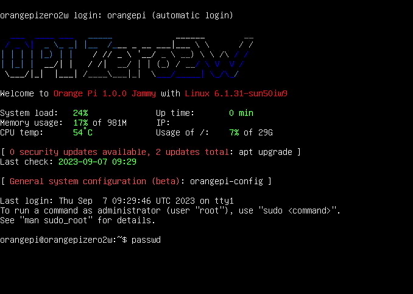

&nbsp;

For the current pasword, type `orangepi` and press enter. (You won't see any characters appear onscreen as you type.) Then choose a new password and enter it. Write down your new password or store it in a password manager app.


&nbsp;

You're currently logged in as a user called `orangepi`. Next you'll switch to the `root` user and change its password.

Type `su root` and press enter. At the prompt, enter the default password `orangepi`.

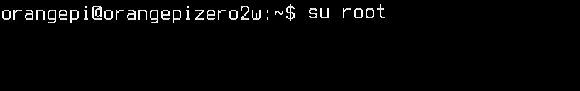

Now type `passwd` and press enter to set a new password for your `root` account.

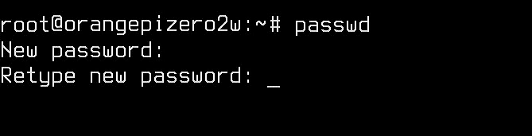

&nbsp;

When you're done, run the command `su orangepi` to switch back to the user `orangepi`.

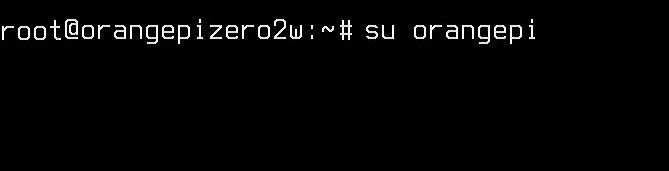

&nbsp;

The default font size is pretty small, so you may want to increase the size. Run the following command to open the `console-setup` preferences file with the text editor `nano`:

```
sudo nano /etc/default/console-setup
```

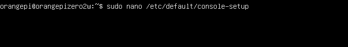

&nbsp;

Use the arrow keys on your keyboard to move the cursor to the line beginning with `FONTSIZE=`. Delete the value `8x16` and replace it with `16x32`.


&nbsp;

When you're finished press `ctrl + X` on your keyboard to close the file. At the bottom left of your screen you'll see the prompt "Save modified buffer?" Type `y` for "yes," then press enter.


&nbsp;

Press enter again to confirm the filename.


&nbsp;

*Tip: You can use the command `clear` at any time to clear the whole screen.*


&nbsp;

Now run the command `sudo update-initramfs -u` to confirm the new font size.

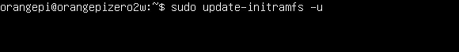

&nbsp;

Reboot your computer with `sudo reboot`.


&nbsp;

When your computer finishes rebooting, you'll be using a larger font.

## Connect to the internet

If you have a USB-to-Ethernet adapter and you're close to your router, connect your computer to the back of the router. You can skip the rest of this section.

If you're using wi-fi instead, follow the steps below.

Run the command `sudo orangepi-config` to launch the Orange Pi configuration utility. (On a Raspberry Pi, use `sudo raspi-config` instead.)


&nbsp;

You'll see a prompt that reads "Configuration cannot work properly without a working internet connection." Press any key to continue.

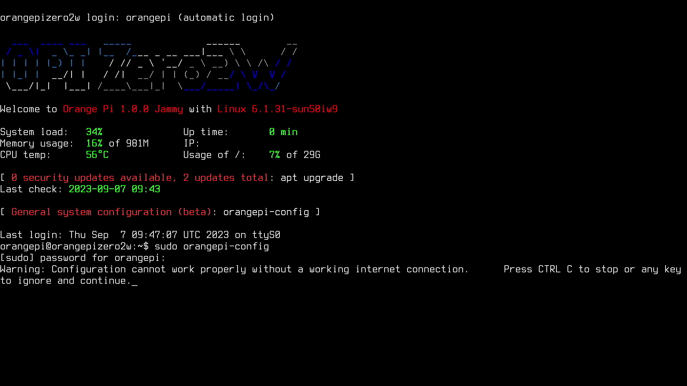

&nbsp;

Use the down arrow key to select the `Network` menu, then press enter.


&nbsp;

Use the down arrow key to select the `WiFi` menu, then press enter.

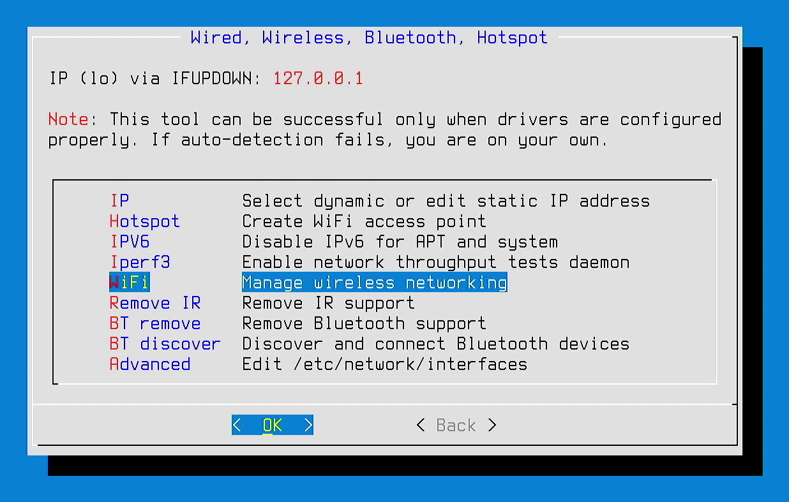

&nbsp;

You'll see a list of available wi-fi networks. Select your home network, then press enter. *(Note: Some routers let you create a secondary wi-fi network, intended to keep IoT (Internet of Things) devices like security cameras separate from your primary network. If you're planning to leave your server connected to wi-fi, you may want to use your router's IoT network as a security precaution.)*


&nbsp;

Enter your password at the prompt.


&nbsp;

Use the arrow keys to select `Quit`, then press enter.


&nbsp;

Use the arrow keys to select `Back` , then press enter.


&nbsp;

Now select `Exit`, then press enter to close the configuration menu.


&nbsp;

## Update your system software

Now that you're connected to the internet, you'll want to update your software packages. This step is important because some packages may need updates for security reasons.

Type the command below (actually two commands separated by `&&`, then press enter. 

```
sudo apt update && sudo apt-y upgrade
```


&nbsp;

Enter your password at the prompt and press enter. It may take 10+ minutes for your packages to download and update.

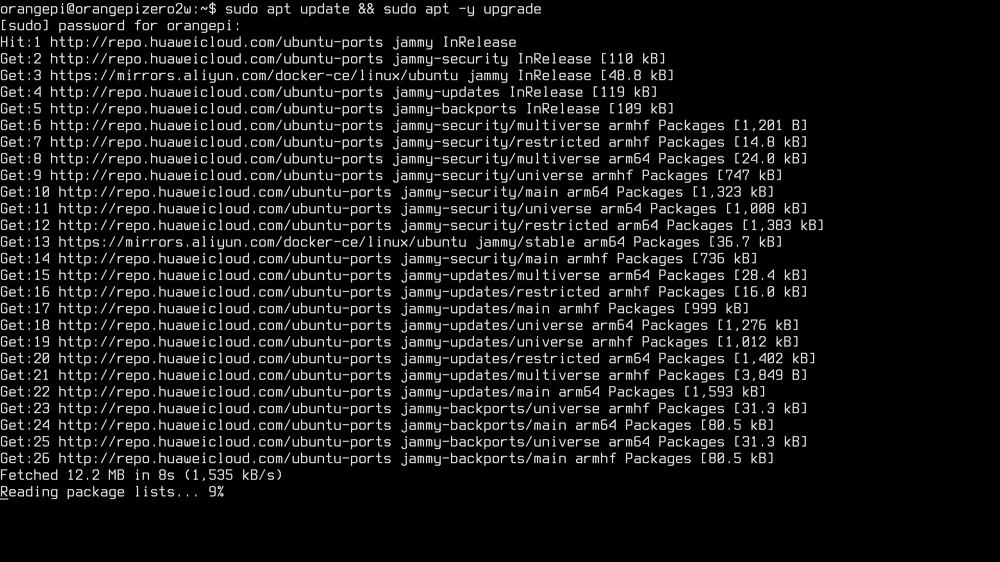

&nbsp;

&nbsp;

&nbsp;

## Update your hostname

&nbsp;

Type the command `hostname` and press enter. You'll see the default hostname, `orangepizero2w`.


&nbsp;

Now run the command below, replacing "Zine-Gallery" with a descriptive name for your server. You'll be prompted to enter your password.

```
hostnamectl set-hostname Zine-Gallery
```


&nbsp;

## Set up a firewall

A firewall is a piece of software that restricts access to your device over the network, allowing certain kinds of network traffic and blocking the rest.

You'll start by installing a firewall program called `ufw` (short for "Uncomplicated Firewall"). Run the command `sudo apt install ufw`, then follow the prompts.


&nbsp;


&nbsp;


&nbsp;


&nbsp;


&nbsp;


## Install Apache


&nbsp;


&nbsp;


&nbsp;


&nbsp;


&nbsp;


&nbsp;

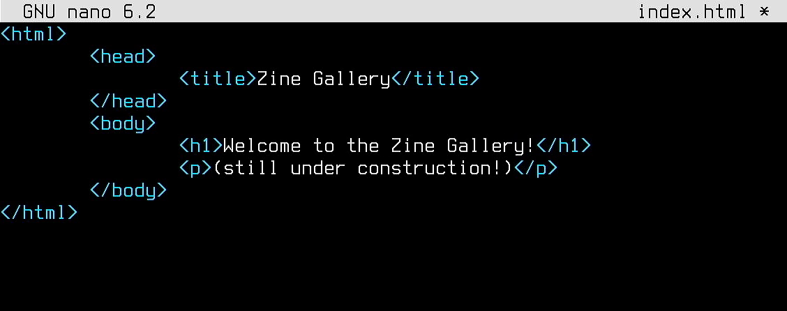

&nbsp;


&nbsp;


&nbsp;


&nbsp;

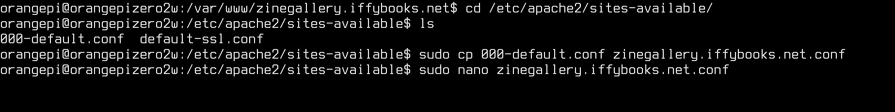

&nbsp;


&nbsp;


&nbsp;


&nbsp;


&nbsp;


&nbsp;

&nbsp;

## UFW Temp


&nbsp;

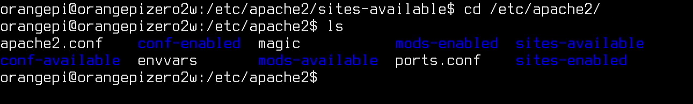

&nbsp;


&nbsp;


&nbsp;


&nbsp;

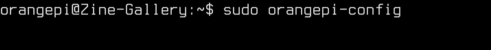

&nbsp;


&nbsp;


&nbsp;


&nbsp;


&nbsp;


&nbsp;


&nbsp;


&nbsp;


&nbsp;


&nbsp;


&nbsp;


&nbsp;


&nbsp;


&nbsp;


&nbsp;


&nbsp;

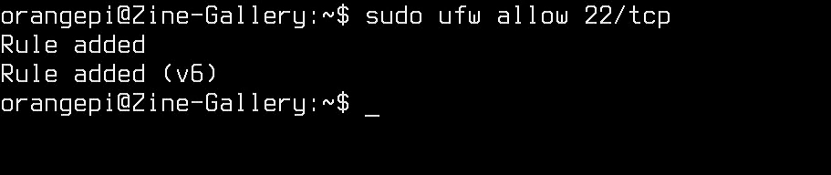

&nbsp;

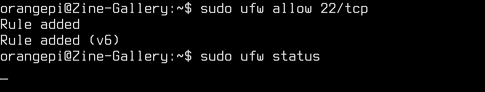

&nbsp;

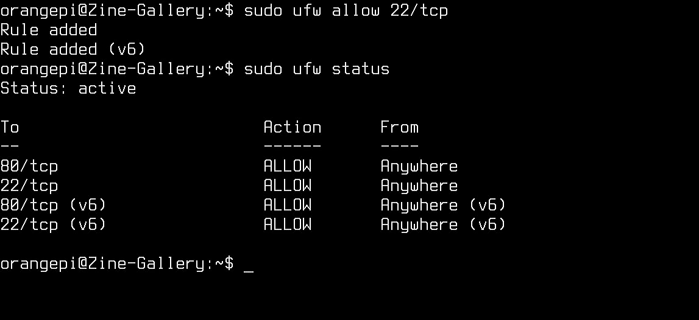

&nbsp;

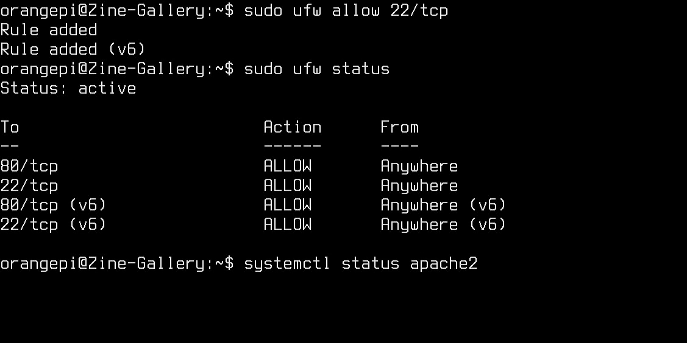

&nbsp;


&nbsp;


&nbsp;


&nbsp;


&nbsp;


&nbsp;


&nbsp;


&nbsp;


&nbsp;


&nbsp;


&nbsp;


&nbsp;

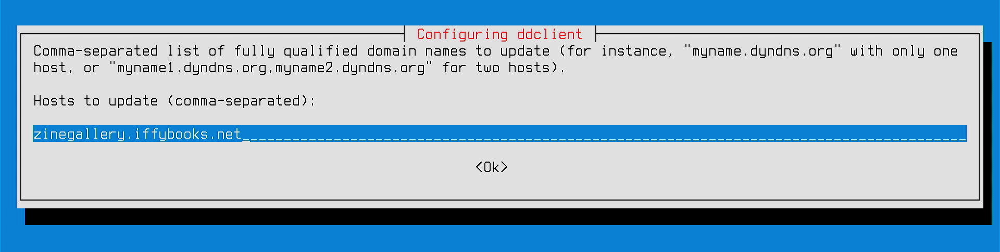

&nbsp;