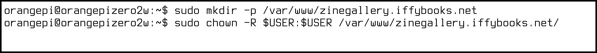
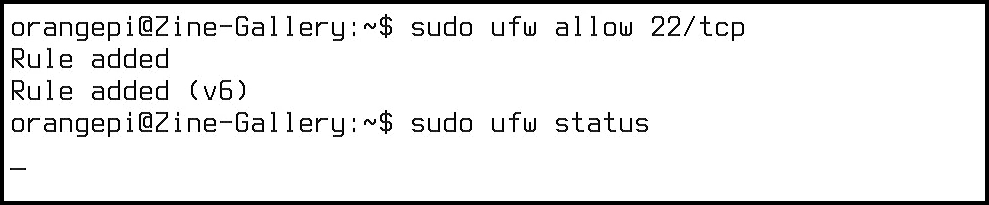
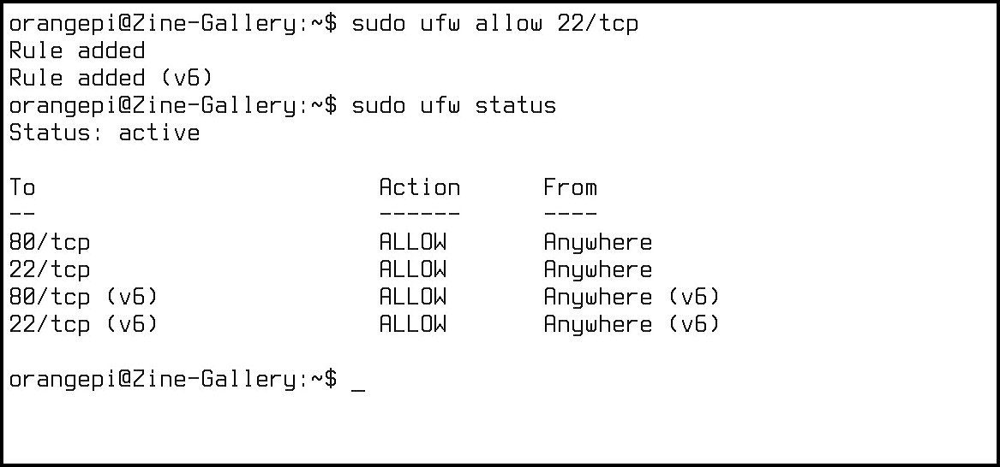
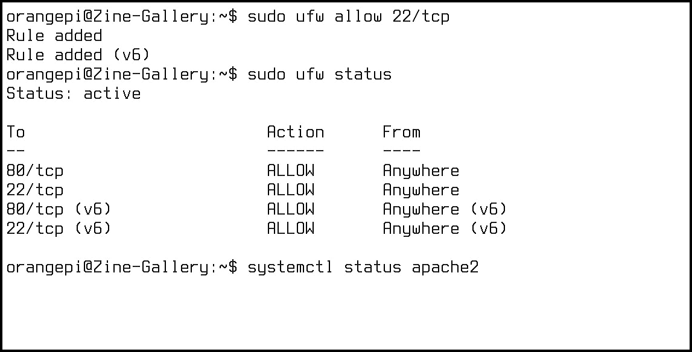
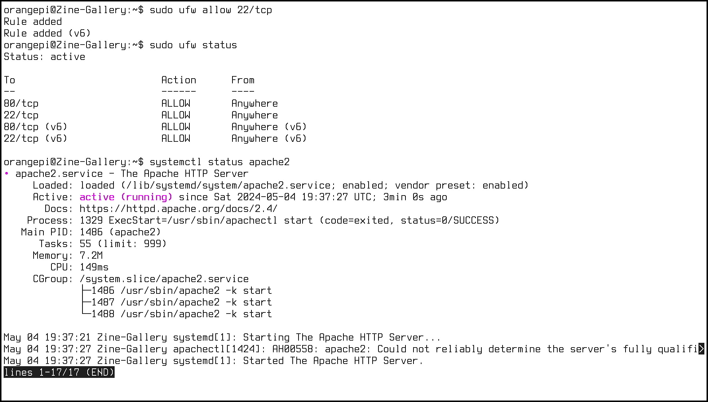
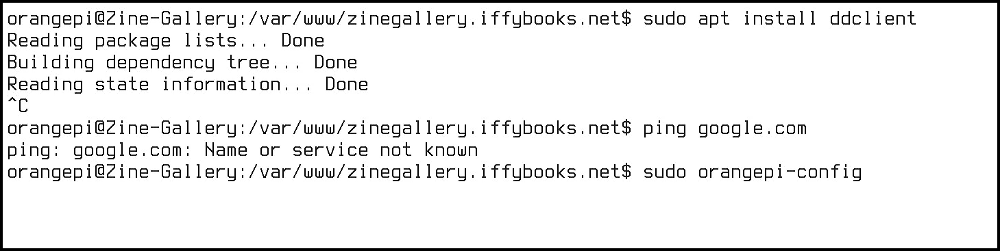
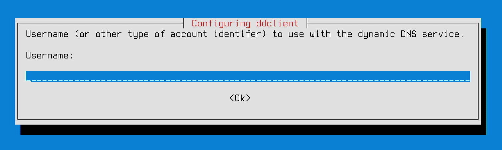
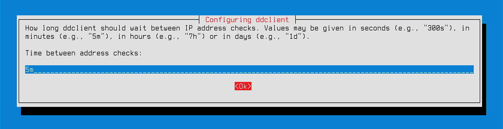

&nbsp;

## Choose a domain

zinegallery.iffybooks.net


## Turn on your computer

Plug in your OPZ2W.

After a brief startup sequence, your screen should look like this:


&nbsp;

*(Note: From this point forward we'll invert the colors in screen captures in order to use less printer toner in printed copies of this guide.)*

First you'll set a password. Type `passwd` at the command prompt, then press enter.


&nbsp;

For the current pasword, type `orangepi` and press enter. (You won't see any characters appear onscreen as you type.) Then choose a new password and enter it. Write down your new password or store it in a password manager app.


&nbsp;

You're currently logged in as a user called `orangepi`. Next you'll switch to the `root` user and change its password.

Type `su root` and press enter. At the prompt, enter the default password `orangepi`.


Now type `passwd` and press enter to set a new password for your `root` account.


&nbsp;

When you're done, run the command `su orangepi` to switch back to the user `orangepi`.


&nbsp;

The default font size is pretty small, so you may want to increase the size. Run the following command to open the `console-setup` preferences file with the text editor `nano`:

```
sudo nano /etc/default/console-setup
```


&nbsp;

Use the arrow keys on your keyboard to move the cursor to the line beginning with `FONTSIZE=`. Delete the value `8x16` and replace it with `16x32`.


&nbsp;

When you're finished press `ctrl + X` on your keyboard to close the file. At the bottom left of your screen you'll see the prompt "Save modified buffer?" Type `y` for "yes," then press enter.


&nbsp;

Press enter again to confirm the filename.


&nbsp;

*Tip: You can use the command `clear` at any time to clear the whole screen.*


&nbsp;

Now run the command `sudo update-initramfs -u` to confirm the new font size.


&nbsp;

Reboot your computer with `sudo reboot`.


&nbsp;

When your computer finishes rebooting, you'll be using a larger font.

## Connect to the internet

If you have a USB-to-Ethernet adapter and you're close to your router, connect your computer to the back of the router. You can skip the rest of this section.

If you're using wi-fi instead, follow the steps below.

Run the command `sudo orangepi-config` to launch the Orange Pi configuration utility. (On a Raspberry Pi, use `sudo raspi-config` instead.)


&nbsp;

You'll see a prompt that reads "Configuration cannot work properly without a working internet connection." Press any key to continue.


&nbsp;

Use the down arrow key to select the `Network` menu, then press enter.


&nbsp;

Use the down arrow key to select the `WiFi` menu, then press enter.


&nbsp;

You'll see a list of available wi-fi networks. Select your home network, then press enter. *(Note: Some routers let you create a secondary wi-fi network, intended to keep IoT (Internet of Things) devices like security cameras separate from your primary network. If you're planning to leave your server connected to wi-fi, you may want to use your router's IoT network as a security precaution.)*


&nbsp;

Enter your password at the prompt.


&nbsp;

Use the arrow keys to select `Quit`, then press enter.


&nbsp;

Use the arrow keys to select `Back` , then press enter.


&nbsp;

Now select `Exit`, then press enter to close the configuration menu.


&nbsp;

## Update your system software

Now that you're connected to the internet, you'll want to update your software packages. This step is important because some packages may need updates for security reasons.

Type the command below (actually two commands separated by `&&`, then press enter. 

```
sudo apt update && sudo apt-y upgrade
```


&nbsp;

Enter your password at the prompt and press enter. It may take 10+ minutes for your packages to download and update.


&nbsp;

&nbsp;

&nbsp;

## Update your hostname

&nbsp;

Type the command `hostname` and press enter. You'll see the default hostname, `orangepizero2w`.


&nbsp;

Now run the command below, replacing "Zine-Gallery" with a descriptive name for your server. You'll be prompted to enter your password.

```
hostnamectl set-hostname Zine-Gallery
```


&nbsp;

## Set up a firewall

A firewall is a piece of software that restricts access to your device over the network, allowing certain kinds of network traffic and blocking the rest.

You'll start by installing a firewall program called `ufw` (short for "Uncomplicated Firewall"). Run the command `sudo apt install ufw`, then follow the prompts.


&nbsp;

Run the command below to deny incoming network connections by default.

```
sudo ufw default deny incoming
```


&nbsp;

Run this command to allow outgoing network connections.

```
sudo ufw default allow outgoing
```


&nbsp;

Run the command below to allow incoming TCP connections on port 80:

```
sudo ufw allow 80/tcp
```


&nbsp;

Now run the command `sudo ufw enable` to turn on your firewall.


## Install Apache

Next you'll install Apache HTTP Server, one of the most widely used web server programs. *(Note: The term "web server" can refer to a piece of software that serves websites, like Apache. "Web server" can also refer to the computer the software is running on.)*

Run the command below to install Apache. You'll be prompted to enter your password.

```
sudo apt install apache2
```


&nbsp;

Next you'll make a directory to store your website files in. The `mkdir` command makes a directory, and the `-p` option creates any parent directories in the path if they don't already exist.

Type the command below to create the directory you'll use for your website files, replacing `zinegallery.iffybooks.net` with the domain you chose earlier.

```
sudo mkdir -p /var/www/zinegallery.iffybooks.net
```


&nbsp;

Now you'll use `chown` to set the current user (`orangepi`) as the owner of the directory you just created. (Replace `zinegallery.iffybooks.net` below with the name of the dictory you just created.)

```
sudo chown -R $USER:$USER /var/www/zinegallery.iffybooks.net
```



&nbsp;

Next you'll use `chmod` to set read-write-execute permissions for the directory `/var/www/`. The `755` option means only the owner (`orangepi`) can write to the directory, while all users will have read and execute permissions.

```
sudo chmod -R 755 /var/www/
```


&nbsp;

Use `cd` to change your current working directory to the directory you just created. *(Tip: After typing `/var/www/` and the first letter or two of your directory name, press **tab** to autocomplete the rest of the pathname.)*

```
cd /var/www/zinegallery.iffybooks.net/
```


&nbsp;

Next you'll use the text editor `nano` to create a file called `index.html`. This will be the first page people will see when they visit your website.

```
sudo nano index.html
```


&nbsp;

Now you'll type out some HTML code for a basic web page, just to use as a test. You can adapt the code below, or do a web search for example web pages.

```
<!DOCTYPE html>
<html>
    <head>
        <title>Zine Gallery</title>
    </head>
    <body>
        <h1>Welcome to the Zine Gallery!</h1>
        <p>(still under construction!)</p>
    </body>
</html>
```


&nbsp;

When you're ready to save your file, press **ctrl+X** to exit. Follow the prompts at the bottom of the screen to save the file.

## Create Apache configuration file

Run the command below to change your current working directory to `/etc/apache2/sites-available`.

```
cd /etc/apache2/sites-available/
```


&nbsp;

Type `ls` and press **enter** to see what files are in the current directory.


&nbsp;

Use `cp` to make a copy of the file `000-default.conf`. In the example below, the new file will be called `zinegallery.iffybooks.net.conf`; yours should be the domain you chose earlier followed by `.conf`.

```
sudo cp 000-default.conf zinegallery.iffybooks.net.conf
```


&nbsp;

Now you'll use `nano` to open the configuration file you just created.

```
sudo nano zinegallery.iffybooks.net.conf
```


&nbsp;

Use your arrow keys to move the cursor to the line `DocumentRoot /var/www/html`. Delete `html` at the end and replace it with the name of the directory where your website files are located (i.e., the domain you chose). Here's an example:

```
DocumentRoot /var/www/zinegallery.iffybooks.net
```


&nbsp;

Create two new lines above the one you just edited, and type out the following options. (If you decide to host more than one website on your server, you'll update these lines later.) When you're done, press **ctrl + X** and follow the prompts to save the file.

```
ServerName localhost
ServerAlias localhost
```


&nbsp;

## Enable your website

Run the following command to have Apache enable your website:

```
sudo a2ensite zinegallery.iffybooks.net.conf
```


&nbsp;

Next, run this command to disable the site Apache runs by default:

```
sudo a2dissite 000-default.conf
```


&nbsp;

Restart Apache with the following command:

```
systemctl reload apache2
```


&nbsp;

## Set up ports.conf

&nbsp;

Run the command `cd /etc/apache2/` to change your curent working directory to `/etc/apache2/`. Then use `ls` to view the directory's contents.


&nbsp;

Use the following command to open the configuration file `ports.conf` with the text editor `nano`.

```
sudo nano ports.conf
```


&nbsp;

Find the line beginning with "Listen" and update it to match the line below. This change will expose your Apache website to other devices on your network.

```
Listen 0.0.0.0:80
```


&nbsp;

&nbsp;

## Find your IP address

Run the command `ip addr` to 


## Test your site on the local network

On a computer connected to the same network as your server, open a web browser, type the server's IP address in the address bar, and press enter. You should see your test website.

## Set a static IP address


&nbsp;


&nbsp;


&nbsp;


&nbsp;


&nbsp;


&nbsp;


&nbsp;


&nbsp;

## Enable SSH access

&nbsp;


&nbsp;


&nbsp;


&nbsp;


&nbsp;


&nbsp;


&nbsp;


&nbsp;


&nbsp;



&nbsp;



&nbsp;



&nbsp;



&nbsp;

## Set up Dynamic DNS


&nbsp;


&nbsp;



&nbsp;

aaa


&nbsp;



&nbsp;


&nbsp;


&nbsp;


&nbsp;



&nbsp;


&nbsp;


&nbsp;